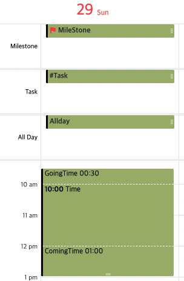
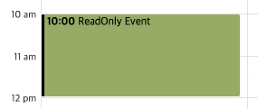
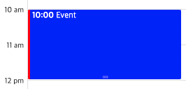

# EventObject

## Description

EventObject is a pure JavaScript object containing event information. It is a value used in various APIs, such as when creating an event, when searching for a specific event, and when handling an instance event.

```js
const calendar = new Calendar('#container');
calendar.createEvents([
  {
    id: '1',
    calendarId: 'cal1',
    title: 'timed event',
    body: 'TOAST UI Calendar',
    start: '2022-06-01T10:00:00',
    end: '2022-06-01T11:00:00',
    location: 'Meeting Room A',
    attendees: ['A', 'B', 'C'],
    category: 'time',
    state: 'Free',
    isReadOnly: true,
    color: '#fff',
    backgroundColor: '#ccc',
    customStyle: {
      fontStyle: 'italic',
      fontSize: '15px',
    },
  }, // EventObject
]);

const timedEvent = calendar.getEvent('1', 'cal1'); // EventObject
calendar.on('clickEvent', ({ event }) => {
  console.log(event); // EventObject
});
```

## The structure of EventObject

EventObject consists of the following properties. Some items have additional explanations, and you can jump to them by clicking on the link.

```ts
interface EventObject {
  id?: string;
  calendarId?: string;
  title?: string;
  body?: string;
  isAllday?: boolean;
  start?: Date | string | number | TZDate;
  end?: Date | string | number | TZDate;
  goingDuration?: number;
  comingDuration?: number;
  location?: string;
  attendees?: string[];
  category?: 'milestone' | 'task' | 'allday' | 'time';
  recurrenceRule?: string;
  state?: 'Busy' | 'Free';
  isVisible?: boolean;
  isPending?: boolean;
  isFocused?: boolean;
  isReadOnly?: boolean;
  isPrivate?: boolean;
  color?: string;
  backgroundColor?: string;
  dragBackgroundColor?: string;
  borderColor?: string;
  customStyle?: JSX.CSSProperties;
  raw?: any;
}
```

| Property                                    | Default value                    | Description                                                                                                                                                                                                              |
| ------------------------------------------- | ------------------------- | ----------------------------------------------------------------------------------------------------------------------------------------------------------------------------------------------------------------- |
| id                                          | <code>''</code>           | Event ID                                                                                                                                                                                                           |
| [calendarId](#calendarcalendarid)             | <code>''</code>           | Calendar ID                                                                                                                                                                                                         |
| title                                       | <code>''</code>           | Title                                                                                                                                                                                                         |
| body                                        | <code>''</code>           | Event body content                                                                                                                                                                                                         |
| [isAllday](#isallday)                       | <code>false</code>        | Whether the event is all-day or not                                                                                                                                                                                                    |
| start                                       | <code>new TZDate()</code> | The date and time the event starts. When creating an event, you can specify it as <code>Date</code>, <code>string</code>, <code>number</code>, or <code>TZDate</code>, and it is a <code>TZDate</code> object in some of calendar APIs parameter or return value. |
| end                                         | <code>new TZDate()</code> | The date and time the event starts. When creating an event, you can specify it as <code>Date</code>, <code>string</code>, <code>number</code>, or <code>TZDate</code>, and it is a <code>TZDate</code> object in some of calendar APIs parameter or return value.   |
| goingDuration                               | <code>0</code>            | The travel time taken to go to the event location. It is a number in minutes.                                                                                                                                                        |
| comingDuration                              | <code>0</code>            | The travel time taken to get back. It is a number in minutes.                                                                                                                                                   |
| location                                    | <code>''</code>           | Location of the event                                                                                                                                                                                                         |
| attendees                                   | <code>[]</code>           | List of attendees                                                                                                                                                                                                  |
| [category](#category)                       | <code>'time'</code>       | Event category. One of <code>milestone</code>, <code>task</code>, <code>allday</code>, or <code>time</code>.                                                                                                     |
| dueDateClass                                | <code>''</code>           | Category for task events. Any string is allowed.                                                                                                                                                                       |
| recurrenceRule                              | <code>''</code>           | Event recurrence rule                                                                                                                                                                                                    |
| state                                       | <code>'Busy'</code>       | Event state. One of <code>Busy</code> and <code>Free</code>.                                                                                                                                        |
| isVisible                                   | <code>true</code>         | Whether the event is visible or not                                                                                                                                                                                                    |
| [isPending](#ispending-isfocused-isprivate) | <code>false</code>        | Whether the event is pending or not                                                                                                                                                                                                  |
| [isFocused](#ispending-isfocused-isprivate) | <code>false</code>        | Whether the event is focused or not                                                                                                                                                                                                    |
| [isReadOnly](#isreadonly)                   | <code>false</code>        | Whether the event is read-only or not                                                                                                                                                                                             |
| [isPrivate](#ispending-isfocused-isprivate) | <code>false</code>        | Whether the event is private or not                                                                                                                                                                                                |
| [color](#style-related-properties)                  | <code>'#000'</code>       | Text color for the event element                                                                                                                                                                                           |
| [backgroundColor](#style-related-properties)        | <code>'#a1b56c'</code>    | Background color for the event element                                                                                                                                                                                             |
| [dragBackgroundColor](#style-related-properties)    | <code>'#a1b56c'</code>    | Background color while dragging the event element                                                                                                                                                                               |
| [borderColor](#style-related-properties)            | <code>'#000'</code>       | Left border color of the event element                                                                                                                                                                                      |
| [customStyle](#style-related-properties)            | <code>{}</code>           | The style to apply to the event element. [A JavaScript object with CSS properties in camelCase](https://reactjs.org/docs/dom-elements.html#style).                                                                           |
| raw                                         | <code>null</code>         | Arbitrary data for the event. You can leverage the property for your own use cases.                                                                                                                                                                                                  |

## Additional information

### Calendar (calendarId)

A calendar is an object used to group events. One event belongs to one calendar and has a unique ID, name, and color value.

```ts
interface CalendarInfo {
  id: string;
  name: string;
  color?: string;
  backgroundColor?: string;
  dragBackgroundColor?: string;
  borderColor?: string;
}
```

To set one or more calendars, you can pass them as option values when creating an instance, or use the `setCalendars` method.

```js
// When creating an instance
const calendar = new Calendar('#container', {
  calendars: [
    {
      id: 'cal1',
      name: 'My Calendar',
    },
    {
      id: 'cal2',
      name: 'Another Calendar',
    },
  ],
});

// After creating an instance
calendar.setCalendars([
  {
    id: 'cal1',
    name: 'My Calendar',
  },
  {
    id: 'cal2',
    name: 'Another Calendar',
  },
]);
```

When a color value is set in a calendar or a color value is set in an event, colors are applied in the following priority order.

1. Event-specific color values
2. Color values in calendar
3. Default if neither is specified

```js
calendar.setCalendars([
  {
    id: 'cal1',
    name: 'My Calendar',
    color: '#000',
    backgroundColor: '#a1b56c',
    dragBackgroundColor: '#a1b56c',
    borderColor: '#000',
  },
  {
    id: 'cal2',
    name: 'Another Calendar',
  },
]);

calendar.createEvents([
  {
    id: '1',
    calendarId: 'cal1',
    title: 'Event 1',
    isAllDay: true,
    start: new Date('2018-08-01'),
    end: new Date('2018-08-02'),
    // The following three colors ignore the color value of cal1.
    color: '#fff',
    backgroundColor: '#3c056d',
    dragBackgroundColor: '#3c056d',
    // borderColor: '#a73eaf' // '#000' of cal1 is applied because it is commented out.
  },
  // This event belongs to cal2, but defaults to cal2 because no color is specified.
  {
    id: '2',
    calendarId: 'cal2',
    title: 'Event 2',
    isAllDay: true,
    start: new Date('2018-08-01'),
    end: new Date('2018-08-02'),
  },
]);
```

### isAllday


Indicates whether the event is all-day or not.

An all-day event can be applied in several ways other than `isAllday`. If any of the cases below are true, it will appear in the All Day event panel.

- When `isAllday` is `true`
- When `category` is `allday`
- When the event duration is more than 24 hours

### category



Events will be rendered in the corresponding panel depending on their category. Category is one of `milestone`, `task`, `allday`, or `time`.

### isReadOnly



Indicates whether the event can be modified. If `isReadOnly` is `true`, you cannot move or resize the event, and the edit button is not exposed in the event detail popup.

### isPending, isFocused, isPrivate

`isPending` indicates whether an event is pending or not, `isFocused` indicates whether an event is focused or not, and `isPrivate` indicates whether an event is private or not. Basically, it does not affect the rendering, and if you want to display the event differently according to these values, you can use the [template](./template.md) functionality.

```js
const calendar = new Calendar('#container', {
  template: {
    time({ title, isPending, isFocused, isPrivate }) {
      if (isPending) {
        return `Pending: ${title}`;
      }

      if (isFocused) {
        return `Focused: ${title}`;
      }

      if (isPrivate) {
        return `Private: ${title}`;
      }

      return title;
    },
  },
});
```

For a detailed example, refer to the [template document](./template.md#time).

### Style-related properties



You can customize the style of event elements with `color`, `backgroundColor`, `dragBackgroundColor`, `borderColor`, and `customStyle`. `color`, `backgroundColor`, `dragBackgroundColor`, `borderColor` can be specified as a [CSS color data type](https://developer.mozilla.org/en-US/docs/Web/CSS/color_value), and `customStyle` can be specified [as a JavaScript object with CSS properties in camelCase](https://reactjs.org/docs/dom-elements.html#style).
