# Options

## Description

You can customize the calendar in various ways with options. You can change options with the option object passed when creating an instance, or freely change options through the `setOptions` method.

```js
// Setting options when creating an instance
calendar = new Calendar('#container', {
  defaultView: 'month',
  isReadOnly: true,
  // ...
});

// Changing options with the setOptions method
calendar.setOptions({
  defaultView: 'week',
  isReadOnly: false,
  // ...
});
```

## Option object

An option object is a nested object with the following properties. Click on the property name to go to the detailed description.

| Property                            | Default value                             | Description                                                                                                   |
| ----------------------------------- | ----------------------------------------- | ------------------------------------------------------------------------------------------------------------- |
| [defaultView](#defaultview)         | <code>'week'</code>                       | Default view type                                                                                             |
| [useFormPopup](#useformpopup)       | <code>false</code>                        | Whether to use the built-in event creation/modification pop-up                                                |
| [useDetailPopup](#usedetailpopup)   | <code>false</code>                        | Whether to use the built-in event details pop-up                                                              |
| [isReadOnly](#isreadonly)           | <code>false</code>                        | Whether the entire calendar is read-only                                                                      |
| [usageStatistics](#usagestatistics) | <code>true</code>                         | Whether to allow hostname collection for [Google Analytics (GA)](https://analytics.google.com/analytics/web/) |
| [eventFilter](#eventfilter)         | <code>(event) => !!event.isVisible</code> | Event filter function across calendars                                                                        |
| [week](#week)                       | <code>DEFAULT_WEEK_OPTIONS</code>         | Weekly/daily view related options                                                                             |
| [month](#month)                     | <code>DEFAULT_MONTH_OPTIONS</code>        | Monthly view related options                                                                                  |
| [gridSelection](#gridselection)     | <code>true</code>                         | Whether clicks and double-clicks are possible for date/time selection                                         |
| [timezone](#timezone)               | <code>{ zones: [] }</code>                | Time zone options used by the calendar                                                                        |
| [theme](#theme)                     | <code>DEFAULT_THEME</code>                | [Theme](./theme.md)                                                                                           |
| [template](#template)               | <code>DEFAULT_TEMPLATE</code>             | [Template](./template.md)                                                                                     |
| [calendars](#calendars)             | <code>[]</code>                           | List of calendars used by the calendar instance                                                               |

## Usage examples

### defaultView

- Type: `'month' | 'week' | 'day'`
- Default: `'week'`

Specifies the default view of the calendar. Monthly view, weekly view, and daily view can be specified and are `'month'`, `'week'`, and `'day'` respectively. The default is `'week'`.

```js
const calendar = new Calendar('#container', {
  defaultView: 'month',
});
```

[⬆️ Back to the list](#option-object)

### useFormPopup

- Type: `boolean`
- Default: `false`

Specifies whether to use the event form popup provided by default in the calendar. The default is `false`.

When using the event form popup, you must import CSS files of [`tui-date-picker`](https://github.com/nhn/tui.date-picker) and [`tui-time-picker`](https://github.com/nhn/tui.time-picker) for the style to be applied properly.

```sh
npm install tui-date-picker tui-time-picker
```

```js
// Load css files of tui-date-picker and tui-time-picker to use the event form popup.
import 'tui-date-picker/dist/tui-date-picker.css';
import 'tui-time-picker/dist/tui-time-picker.css';

calendar.setOptions({
  useFormPopup: true,
  useDetailPopup: true,
});
```

[⬆️ Back to the list](#option-object)

### useDetailPopup

- Type: `boolean`
- Default: `false`

Specifies whether to use the event details popup provided by default in the calendar. The default is `false`.

```js
const calendar = new Calendar('#container', {
  useDetailPopup: true,
});
```

[⬆️ Back to the list](#option-object)

### isReadOnly

- Type: `boolean`
- Default: `false`

Specifies whether to make the calendar read-only. The default value is `false`. If set to `true`, users cannot create or edit events in the calendar.

```js
const calendar = new Calendar('#container', {
  isReadOnly: true,
});
```

[⬆️ Back to the list](#option-object)

### usageStatistics

- Type: `boolean`
- Default: `true`

Specifies whether to allow hostname collection for [Google Analytics (GA)](https://analytics.google.com/analytics/web/). The default value is `true`. If set to `false`, statistics are not collected.

[TOAST UI Calendar](https://github.com/nhn/tui.calendar) applies [GA](https://analytics.google.com/analytics/web/) to collect statistics on open source usage to see how widely it is used around the world. This serves as an important indicator to determine the future progress of the project. It collects `location.hostname` (e.g. "ui.toast.com") and is only used to measure usage statistics.

```js
const calendar = new Calendar('#container', {
  usageStatistics: false,
});
```

[⬆️ Back to the list](#option-object)

### eventFilter

- Type: `(event: EventObject) => boolean`
- Default: `(event) => !!event.isVisible`

Specifies the event filtering conditions of the calendar. The default value is `(event) => !!event.isVisible`, which renders only events for which the `isVisible` property of the event is `true`.

If `isVisible` is not filtered when applying a custom event filter, events with `isVisible: false` may appear in the calendar.

```js
const calendar = new Calendar('#container', {
  eventFilter: (event) => event.isVisible && event.isAllday,
});
```

[⬆️ Back to the list](#option-object)

### week

- Type: `WeekOptions`
- Default: `DEFAULT_WEEK_OPTIONS`

```ts
type EventView = 'allday' | 'time';
type TaskView = 'milestone' | 'task';

interface WeekOptions {
  startDayOfWeek?: number;
  dayNames?: [string, string, string, string, string, string, string];
  narrowWeekend?: boolean;
  workweek?: boolean;
  showNowIndicator?: boolean;
  showTimezoneCollapseButton?: boolean;
  timezonesCollapsed?: boolean;
  hourStart?: number;
  hourEnd?: number;
  eventView?: boolean | EventView[];
  taskView?: boolean | TaskView[];
}
```

```js
const DEFAULT_WEEK_OPTIONS = {
  startDayOfWeek: 0,
  dayNames: [],
  narrowWeekend: false,
  workweek: false,
  showNowIndicator: true,
  showTimezoneCollapseButton: false,
  timezonesCollapsed: false,
  hourStart: 0,
  hourEnd: 24,
  eventView: true,
  taskView: true,
};
```

Specifies options related to weekly/daily views.

[⬆️ Back to the list](#option-object)

#### week.startDayOfWeek

- Type: `number`
- Default: `0`

Specifies the start day of the week in the daily/weekly view. The default is `0`, starting from Sunday. You can specify a value from `0` (Sunday) to `6` (Saturday).

| Value | Day of the week |
| ----- | --------------- |
| 0     | Sunday          |
| 1     | Monday          |
| 2     | Tuesday         |
| 3     | Wednesday       |
| 4     | Thursday        |
| 5     | Friday          |
| 6     | Saturday        |

```js
calendar.setOptions({
  week: {
    startDayOfWeek: 1,
  },
});
```

| Default                                                                             | Example                                                                            |
| ----------------------------------------------------------------------------------- | ---------------------------------------------------------------------------------- |
|  |  |

[⬆️ Back to the list](#week)

#### week.dayNames

- Type: `[string, string, string, string, string, string, string]`
- Default: `[]`

You can change the name of the day of the week in the daily/weekly view. The default value is `[]`, starting from the day of the week set by [startDayOfWeek](#week.startDayOfWeek).

When giving this option, an array with all days of the week from Sunday to Monday must be entered. The index of each day is the same as the result of `Date.prototype.getDay`. ([Reference](https://tc39.es/ecma262/multipage/numbers-and-dates.html#sec-week-day))

```js
calendar.setOptions({
  week: {
    dayNames: ['월', '화', '수', '목', '금', '토', '일'],
  },
});
```

| Default                                                                 | Example                                                                |
| ----------------------------------------------------------------------- | ---------------------------------------------------------------------- |
|  |  |

[⬆️ Back to the list](#week)

#### week.narrowWeekend

- Type: `boolean`
- Default: `false`

In the daily/weekly view, the width of the weekend can be narrowed (1/2 of the existing width). The default value is `false`. In order to narrow the width of the weekend, set it to `true`.

```js
calendar.setOptions({
  week: {
    narrowWeekend: true,
  },
});
```

| Default                                                                           | Example                                                                          |
| --------------------------------------------------------------------------------- | -------------------------------------------------------------------------------- |
|  |  |

[⬆️ Back to the list](#week)

#### week.workweek

- Type: `boolean`
- Default: `false`

Weekends can be excluded from the daily/weekly view. The default value is `false`, and to exclude weekends, set it to `true`.

```js
calendar.setOptions({
  week: {
    workweek: true,
  },
});
```

| Default                                                                 | Example                                                                |
| ----------------------------------------------------------------------- | ---------------------------------------------------------------------- |
|  |  |

[⬆️ Back to the list](#week)

#### week.showNowIndicator

- Type: `boolean`
- Default: `true`

You can specify whether to display the current time indicator in the weekly/daily view. The default value is `true`, and if you do not want to display the current time indicator, set it to `false`.

```js
calendar.setOptions({
  week: {
    showNowIndicator: false,
  },
});
```

| Default                                                                                 | Example                                                                                |
| --------------------------------------------------------------------------------------- | -------------------------------------------------------------------------------------- |
| 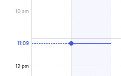 | 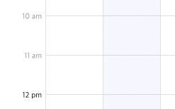 |

#### week.showTimezoneCollapseButton

- Type: `boolean`
- Default: `false`

When using multiple time zones in the weekly/daily view, you can specify whether to display the button to collapse the sub time zones. The default value is `false`, and set it to `true` to display the collapse button.

```js
calendar.setOptions({
  week: {
    showTimezoneCollapseButton: true,
  },
});
```

| Default                                                                                                     | Example                                                                                                    |
| ----------------------------------------------------------------------------------------------------------- | ---------------------------------------------------------------------------------------------------------- |
|  |  |

[⬆️ Back to the list](#week)

#### week.timezonesCollapsed

- Type: `boolean`
- Default: `false`

When using multiple time zones in the weekly/daily view, you can specify whether to display the sub time zones in a collapsed state. The default value is `false`, and set it to `true` to display in the collapsed state.

```js
calendar.setOptions({
  week: {
    timezonesCollapsed: true,
  },
});
```

| Default                                                                                     | Example                                                                                    |
| ------------------------------------------------------------------------------------------- | ------------------------------------------------------------------------------------------ |
| 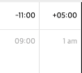 |  |

[⬆️ Back to the list](#week)

#### week.hourStart

- Type: `number`
- Default: `0`

Specifies the start time of each column in the weekly/daily view. The default value is `0`, and you can specify any desired start time.

```js
calendar.setOptions({
  week: {
    hourStart: 9,
  },
});
```

| Default                                                                   | Example                                                                  |
| ------------------------------------------------------------------------- | ------------------------------------------------------------------------ |
| 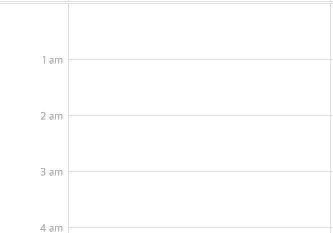 | 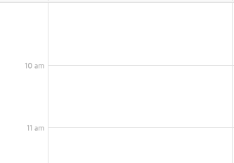 |

[⬆️ Back to the list](#week)

#### week.hourEnd

- Type: `number`
- Default: `24`

Specifies the end time of each column in the weekly/daily view. The default value is `24`, and you can specify any desired end time.

```js
calendar.setOptions({
  week: {
    hourEnd: 18,
  },
});
```

| Default                                                               | Example                                                              |
| --------------------------------------------------------------------- | -------------------------------------------------------------------- |
|  | 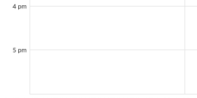 |

[⬆️ Back to the list](#week)

#### week.eventView

- Type: `boolean | ('allday' | 'time')[]`
- Default: `true`

You can specify whether to display the allday panel and the time panel in the weekly/daily view. The default is `true`, and both the allday panel and the time panel are displayed. If `false`, both panels are not displayed, and in case of `['allday']`, only the allday panel is displayed. In case of `['time']`, only the time panel is displayed.

```js
calendar.setOptions({
  week: {
    eventView: false,
  },
});
```

| Default                                                                   | Example                                                                  |
| ------------------------------------------------------------------------- | ------------------------------------------------------------------------ |
|  |  |

[⬆️ Back to the list](#week)

#### week.taskView

- Type: `boolean | ('milestone' | 'task')[]`
- Default: `true`

You can specify whether to display the milestone panel and the task panel in the weekly/daily view. The default value is `true`, and both the milestone panel and the task panel are displayed. If `false`, both panels are not displayed, and in case of `['milestone']`, only the milestone panel is displayed. In case of `['task']`, only the task panel is displayed.

```js
calendar.setOptions({
  week: {
    taskView: false,
  },
});
```

| Default                                                                 | Example                                                                |
| ----------------------------------------------------------------------- | ---------------------------------------------------------------------- |
|  | 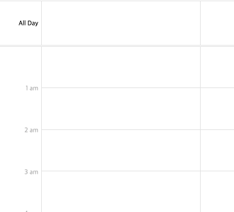 |

[⬆️ Back to the list](#week)

### month

- Type: `MonthOptions`
- Default: `DEFAULT_MONTH_OPTIONS`

```ts
interface MonthOptions {
  dayNames?: [string, string, string, string, string, string, string];
  startDayOfWeek?: number;
  narrowWeekend?: boolean;
  visibleWeeksCount?: number;
  isAlways6Weeks?: boolean;
  workweek?: boolean;
  visibleEventCount?: number;
}
```

```js
const DEFAULT_MONTH_OPTIONS = {
  dayNames: ['sun', 'mon', 'tue', 'wed', 'thu', 'fri', 'sat'],
  visibleWeeksCount: 0,
  workweek: false,
  narrowWeekend: false,
  startDayOfWeek: 0,
  isAlways6Weeks: true,
  visibleEventCount: 6,
};
```

Specifies options related to the monthly view.

[⬆️ Back to the list](#option-object)

#### month.dayNames

- Type: `[string, string, string, string, string, string, string]`
- Default: `['sun', 'mon', 'tue', 'wed', 'thu', 'fri', 'sat']`

You can change the name of the day of the week in the monthly view. The default value is `['sun', 'mon', 'tue', 'wed', 'thu', 'fri', 'sat']`, starting from the day of the week set by [startDayOfWeek](#month.startDayOfWeek).

When giving this option, an array with all days of the week from Sunday to Monday must be entered. The index of each day is the same as the result of `Date.prototype.getDay`. ([Reference](https://tc39.es/ecma262/multipage/numbers-and-dates.html#sec-week-day))

| Value | Day of the week |
| ----- | --------------- |
| 0     | Sunday          |
| 1     | Monday          |
| 2     | Tuesday         |
| 3     | Wednesday       |
| 4     | Thursday        |
| 5     | Friday          |
| 6     | Saturday        |

```js
calendar.setOptions({
  month: {
    dayNames: ['일', '월', '화', '수', '목', '금', '토'],
  },
});
```

| Default                                                                   | Example                                                                  |
| ------------------------------------------------------------------------- | ------------------------------------------------------------------------ |
|  |  |

[⬆️ Back to the list](#month)

#### month.startDayOfWeek

- Type: `number`
- Default: `0`

Specifies the start day of the week in the monthly view. The default is `0`, starting from Sunday. You can specify a value from `0` (Sunday) to `6` (Saturday).

The index of each day of the week is the same as the result of `Date.prototype.getDay`. ([Reference](https://tc39.es/ecma262/multipage/numbers-and-dates.html#sec-week-day))

| Value | Day of the week |
| ----- | --------------- |
| 0     | Sunday          |
| 1     | Monday          |
| 2     | Tuesday         |
| 3     | Wednesday       |
| 4     | Thursday        |
| 5     | Friday          |
| 6     | Saturday        |

```js
calendar.setOptions({
  month: {
    startDayOfWeek: 1,
  },
});
```

| Default                                                                               | Example                                                                              |
| ------------------------------------------------------------------------------------- | ------------------------------------------------------------------------------------ |
|  |  |

[⬆️ Back to the list](#month)

#### month.narrowWeekend

- Type: `boolean`
- Default: `false`

You can narrow the width of weekends (1/2 of the existing width) in the monthly view. The default value is `false`, and to narrow the width of the weekend, set it to `true`.

```js
calendar.setOptions({
  month: {
    narrowWeekend: true,
  },
});
```

| Default                                                                             | Example                                                                            |
| ----------------------------------------------------------------------------------- | ---------------------------------------------------------------------------------- |
|  |  |

[⬆️ Back to the list](#month)

#### month.visibleWeeksCount

- Type: `number`
- Default: `0`

Specifies the number of weeks shown in the monthly view. The default value is `0`, indicating 6 weeks. You can specify a value from `1` to `6` to specify a different number of weeks.

⚠️ If you set this option, the current date will always be in the first week.

```js
calendar.setOptions({
  month: {
    visibleWeeksCount: 2,
  },
});
```

| Default                                                                                     | Example                                                                                    |
| ------------------------------------------------------------------------------------------- | ------------------------------------------------------------------------------------------ |
| 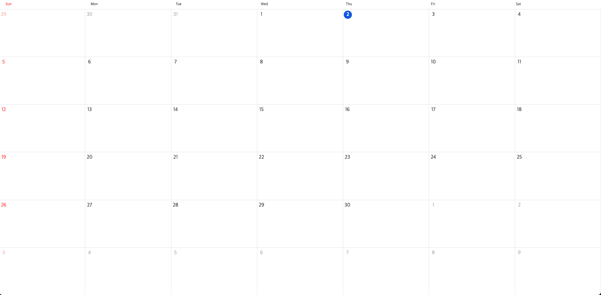 | 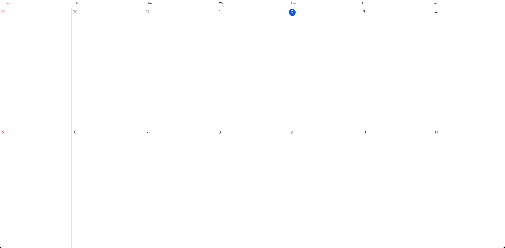 |

[⬆️ Back to the list](#month)

#### month.isAlways6Weeks

- Type: `boolean`
- Default: `true`

Determines whether to always display the calendar every six weeks in the monthly view. The default value is `true`, and 6 weeks are displayed regardless of the total number of weeks in the month being displayed.

If set to `false`, 4 to 6 weeks are displayed according to the number of displayable weeks in the month.

```js
calendar.setOptions({
  month: {
    isAlways6Weeks: false,
  },
});
```

| Default                                                                               | Example                                                                              |
| ------------------------------------------------------------------------------------- | ------------------------------------------------------------------------------------ |
|  |  |

[⬆️ Back to the list](#month)

#### month.workweek

- Type: `boolean`
- Default: `false`

Weekends can be excluded from the monthly view. The default value is `false`, and to exclude weekends, set it to `true`.

```js
calendar.setOptions({
  month: {
    workweek: true,
  },
});
```

| Default                                                                   | Example                                                                  |
| ------------------------------------------------------------------------- | ------------------------------------------------------------------------ |
|  |  |

[⬆️ Back to the list](#month)

#### month.visibleEventCount

- Type: `number`
- Default: `6`

Specifies the maximum number of events displayed for each date in the monthly view. The default is `6`.

Even though you set this option, if the height of the date is insufficient, the option is automatically ignored.

It is affected by the entire calendar area and [the gridCell property of the month theme](./theme.md#month-gridcell).

```js
calendar.setOptions({
  month: {
    visibleEventCount: 2,
  },
});
```

| Default                                                                                     | Example                                                                                    |
| ------------------------------------------------------------------------------------------- | ------------------------------------------------------------------------------------------ |
|  | 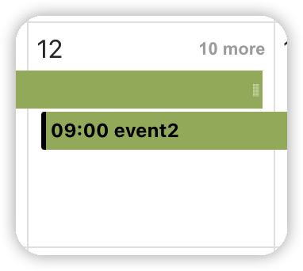 |

[⬆️ Back to the list](#month)

### gridSelection

- Type: `boolean | GridSelectionOptions`
- Default: `true`

```ts
interface GridSelectionOptions {
  enableDblClick?: boolean;
  enableClick?: boolean;
}
```

Specifies whether clicks and double-clicks are possible when selecting the date/time of the calendar. The default is `true`. When it is specified as a `boolean` type of `true` or `false`, both click and double click are enabled or disabled. You can also specify click and double click respectively with the object type like `{ enableDblClick: boolean;`  `enableClick: boolean }`.

```js
const calendar = new Calendar('#container', {
  gridSelection: {
    enableDblClick: false,
    enableClick: true,
  },
});
```

[⬆️ Back to the list](#option-object)

### timezone

- Type: `TimezoneOptions`
- Default: `{ zones: [] }`

⚠️ To use the time zone function, it needs a modern browser environment that supports the `Intl.DateTimeFormat` API as well as the IANA time zone database.
⚠️ If you need to support Internet Explorer 11, you need to apply a polyfill or use the `customOffsetCalculator` option with a separate library.

- [Support range (caniuse)](https://caniuse.com/mdn-javascript_builtins_date_tolocaletimestring_iana_time_zone_names)
- [`Intl.DateTimeFormat polyfill`](https://formatjs.io/docs/polyfills/intl-datetimeformat/)

```ts
interface TimezoneConfig {
  timezoneName: string;
  displayLabel?: string;
  tooltip?: string;
}

interface TimezoneOptions {
  zones?: TimezoneConfig[];
  customOffsetCalculator?: (timezoneName: string, timestamp: number) => number;
}
```

#### Default time zone setting

You can set the time zones used in the calendar. The default is `{ zones: [] }`. `zones` is an array of time zone information. For the time zone information, you can specify with the name of the time zone (`timezoneName`) and the display label (`displayLabel`) and tooltip (`tooltip`) used in the weekly/daily view.

If there are more than one time zone information in the time zone information array, the calendar sets the first element of the array as the default time zone.

```js
// Setting the default time zone to London regardless of the time zone of the system the browser is running
const calendar = new Calendar('#container', {
  timezone: {
    zones: [
      {
        timezoneName: 'Europe/London',
      },
    ],
  },
});
```

If two or more time zones are set and the weekly/daily view is displayed, the display label and tooltip are displayed on the left side. It doesn't affect anything else.

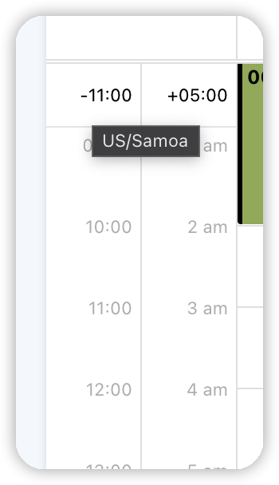

#### Using user-defined time zone offset calculator

The `customOffsetCalculator` must calculate the offset difference between the given time zone and UTC in a user-defined method and return it in minutes. For example, if the time zone name is `'Asia/Seoul'`, it is `UTC +9`, so `540` must be returned.

If the `customOffsetCalculator` is defined, the calendar uses this calculator for all logic that calculates the time zone. Otherwise, there is no need to define this option except for special cases because the calendar uses the [`Intl.DateTimeFormat` API](https://developer.mozilla.org/en-US/docs/Web/JavaScript/Reference/Global_Objects/Intl/DateTimeFormat) by default.

It is recommended not to use the `customOffsetCalculator` option unless there are special cases such as using a separate library to support older browsers.

```js
// Calculating the offset with moment timezone
function momentTZCalculator(timezoneName, timestamp) {
  return moment.tz(timezoneName).utcOffset(timestamp);
}

// Calculating the offset with Luxon
luxonTZCalculator(timezoneName, timestamp) {
  return DateTime.fromMillis(timestamp).setZone(timezoneName).offset;
}

// Calculating the offset with date-fns-tz
function dateFnsTZCalculator(timezoneName, timestamp) {
  return getTimezoneOffset(timezoneName, new Date(timestamp));
}

// ...

const calendar = new Calendar('#container', {
  timezone: {
    zones: [
      {
        timezoneName: 'Asia/Seoul',
        displayLabel: 'Seoul',
        tooltip: 'Seoul Time',
      },
      {
        timezoneName: 'Asia/Tokyo',
        displayLabel: 'Tokyo',
        tooltip: 'Tokyo Time',
      },
    ],
    customOffsetCalculator: momentTZCalculator, // or luxonTZCalculator, dateFnsTZCalculator
  },
});
```

[⬆️ Back to the list](#option-object)

### theme

- Type: `ThemeObject`
- Default: `DEFAULT_THEME`

Specifies the theme of the calendar. It can be applied when creating a calendar instance or can be changed with the `setTheme` method instead. More information can be found in the [theme documentation](./theme.md).

[⬆️ Back to the list](#option-object)

### template

- Type: `TemplateObject`
- Default: `DEFAULT_TEMPLATE`

Specifies the calendar template. More details can be found in the [Templates documentation](./template.md).

[⬆️ Back to the list](#option-object)

### calendars

- Type: `CalendarInfo[]`
- Default: `[]`

Specifies the list of calendars used in the calendar. Each calendar information in the calendar list can have the `id`, calendar name, and color information of the corresponding calendar. The default is `[]`. For a detailed description of calendar information, refer to the [EventObject document](./event-object.md#calendarcalendarid).

```ts
interface CalendarInfo {
  id: string;
  name: string;
  color?: string;
  backgroundColor?: string;
  dragBackgroundColor?: string;
  borderColor?: string;
}
```

[⬆️ Back to the list](#option-object)
