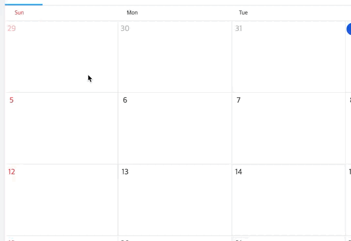
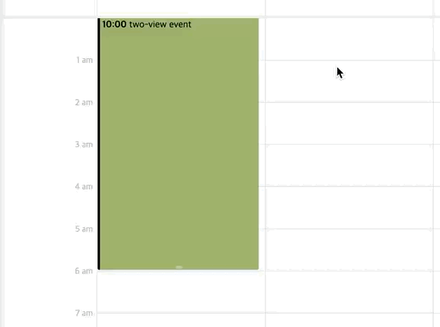
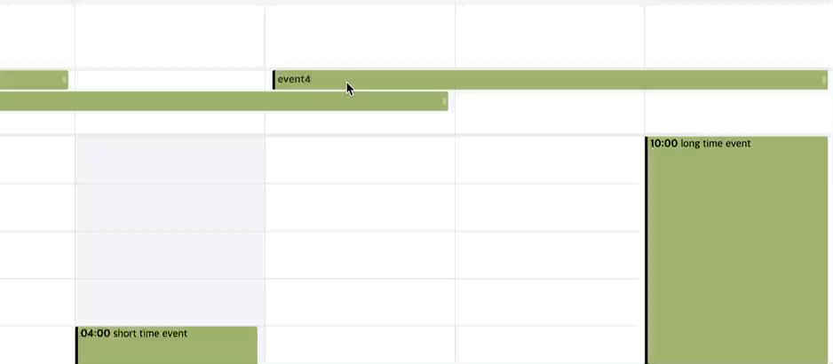
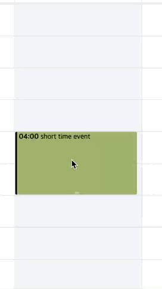
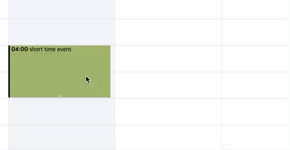
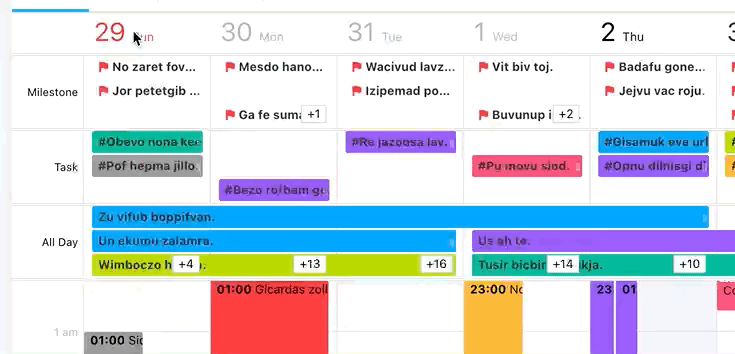
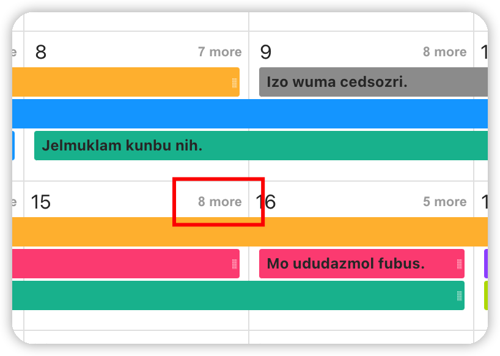
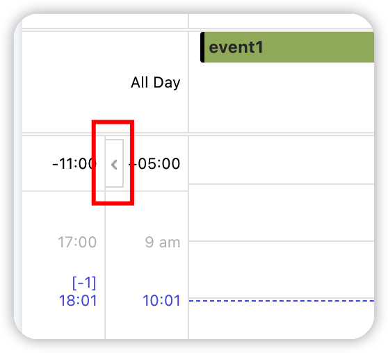

# Calendar 클래스

## 설명

`Calendar` 클래스를 사용하여 캘린더 인스턴스를 생성할 수 있다. 인스턴스를 생성하고 싶은 위치(HTML 요소)를 지정하고, 필요하다면 적절한 옵션을 설정해야 한다.

캘린더 인스턴스 생성 시 첫 번째 인자로 캘린더 인스턴스가 마운트 될 요소를 설정한다. **이 요소는 적절한 높이의 `height` 값을 가지고 있어야 한다. (최소 600px 이상 권장)**

```js
import { Calendar } from '@toast-ui/calendar';

// 요소를 직접 전달하는 경우
const container = document.querySelector('#container');
const calendar = new Calendar(container);

// CSS 선택자를 이용하는 경우
const calendar = new Calendar('#container');
```

캘린더 인스턴스 생성 시 두 번째 인자로 옵션을 설정할 수 있다. 별도로 지정하지 않은 옵션은 기본값이 설정된다. 옵션에 대한 자세한 정보는 [옵션 문서](./options.md) 살펴볼 수 있다.

```js
const calendar = new Calendar(container, {
  // 캘린더 인스턴스 옵션
  defaultView: 'month',
  isReadOnly: true,
  timezone: {
    // ...
  },
  theme: {
    // ...
  },
  template: {
    // ...
  },
});
```

인스턴스를 생성한 이후 캘린더 [인스턴스 메서드](#인스턴스-메서드)를 사용하여 캘린더의 동작을 제어할 수 있고, [인스턴스 이벤트](#인스턴스-이벤트)에 이벤트 핸들러를 등록할 수 있다.

```js
const calendar = new Calendar('#container');

// 인스턴스 이벤트 설정
calendar.on('beforeCreateEvent', (eventObj) => {
  // 이벤트 실행 시 인스턴스 메서드 활용
  calendar.createEvents([
    {
      ...eventObj,
      id: uuid(),
    },
  ]);
});
```

## 인스턴스 메서드

💡 메서드를 클릭하면 더 자세한 설명과 사용 예시를 볼 수 있다.

| 메서드                                          | 설명                                                                                                                       |
| ----------------------------------------------- | -------------------------------------------------------------------------------------------------------------------------- |
| [render](#render)                               | 캘린더 인스턴스를 화면에 렌더링한다.                                                                                       |
| [renderToString](#rendertostring)               | 서버 사이드 렌더링에서 활용할 수 있도록 현재 캘린더 인스턴스의 렌더링 결과물을 HTML 문자열로 리턴한다.                     |
| [destroy](#destroy)                             | 캘린더 인스턴스를 제거한다.                                                                                                |
| [getEvent](#getevent)                           | 지정된 이벤트의 데이터를 가져온다.                                                                                         |
| [createEvents](#createevents)                   | 한개 이상의 캘린더 이벤트를 생성한다.                                                                                      |
| [updateEvent](#updateevent)                     | 지정된 이벤트의 내용을 업데이트한다.                                                                                       |
| [deleteEvent](#deleteevent)                     | 지정된 이벤트를 삭제한다.                                                                                                  |
| [clear](#clear)                                 | 캘린더 인스턴스에 저장된 모든 이벤트를 제거한다.                                                                           |
| [today](#today)                                 | 현재 날짜가 포함된 범위로 이동한다.                                                                                        |
| [move](#move)                                   | 뷰에 따라 주어진 숫자만큼 구간을 이동한다.                                                                                 |
| [prev](#prev)                                   | 현재 화면의 이전 구간으로 이동한다. 이동 범위는 뷰의 범위에 따라 다르다.                                                   |
| [next](#next)                                   | 현재 화면의 다음 구간으로 이동한다. 이동 범위는 뷰의 범위에 따라 다르다.                                                   |
| [setDate](#setdate)                             | 지정된 날짜가 포함된 범위로 이동한다.                                                                                      |
| [changeView](#changeview)                       | 캘린더 인스턴스의 뷰를 월간/주간/일간으로 변경한다.                                                                        |
| [getElement](#getelement)                       | 특정 이벤트가 렌더링된 HTML 엘리먼트를 찾는다. 찾지 못한 경우 `null` 을 리턴한다.                                          |
| [setTheme](#settheme)                           | 캘린더 인스턴스의 테마를 변경한다.                                                                                         |
| [getOptions](#getoptions)                       | 현재 캘린더 인스턴스에 설정된 옵션 정보를 가져온다.                                                                        |
| [setOptions](#setoptions)                       | 캘린더 인스턴스의 옵션을 변경한다.                                                                                         |
| [getDate](#getdate)                             | 현재 캘린더 인스턴스의 화면을 표시하는 기준 날짜를 가져온다.                                                               |
| [getDateRangeStart](#getdaterangestart)         | 현재 캘린더 인스턴스의 화면을 표시하는 날짜 범위 중 시작일을 가져온다.                                                     |
| [getDateRangeEnd](#getdaterangeend)             | 현재 캘린더 인스턴스의 화면을 표시하는 날짜 범위 중 종료일을 가져온다.                                                     |
| [getViewName](#getviewname)                     | 현재 캘린더 인스턴스의 화면의 타입을 가져온다. (월간 / 주간 / 일간)                                                        |
| [setCalendars](#setcalendars)                   | 캘린더 정보를 변경한다.                                                                                                    |
| [setCalendarVisibility](#setcalendarvisibility) | 지정된 이벤트 그룹에 포함되는 모든 이벤트를 숨기거나 표시한다.                                                             |
| [setCalendarColor](#setcalendarcolor)           | 지정된 이벤트 그룹에 포함된 모든 이벤트의 컬러 값을 변경한다.                                                              |
| [scrollToNow](#scrolltonow)                     | 일간 뷰 혹은 주간 뷰에서 현재 시간이 포함된 범위를 표시하고 있는 경우, 즉시 현재 시간 영역으로 스크롤을 이동한다.          |
| [openFormPopup](#openformpopup)                 | 이벤트를 생성하는데 사용하는 팝업을 표시한다. 전달한 객체의 정보에 따라 팝업의 값이 채워져 있다.                           |
| [clearGridSelections](#cleargridselections)     | 현재 캘린더에 표시되고 있는 날짜/시간 선택 엘리먼트를 제거한다.                                                            |
| [fire](#fire)                                   | 임의의 인스턴스 이벤트를 실행한다. 자세한 설명은 [인스턴스 이벤트](#인스턴스-이벤트) 단락에서 설명한다.                    |
| [off](#off)                                     | 임의의 인스턴스 이벤트를 해제한다. 자세한 설명은 [인스턴스 이벤트](#인스턴스-이벤트) 단락에서 설명한다.                    |
| [on](#on)                                       | 임의의 인스턴스 이벤트를 할당한다. 자세한 설명은 [인스턴스 이벤트](#인스턴스-이벤트) 단락에서 설명한다.                    |
| [once](#once)                                   | 임의의 인스턴스 이벤트를 한 번만 실행되도록 할당한다. 자세한 설명은 [인스턴스 이벤트](#인스턴스-이벤트) 단락에서 설명한다. |

### render

- 타입: `render(): Calendar`
- 리턴: `Calendar` - 캘린더 인스턴스

브라우저 환경에서 캘린더 인스턴스를 생성하면 자동으로 호출되는 메서드이다.

처음 호출될 때 인스턴스 생성 시 인자로 전달한 HTML 엘리먼트 아래에 캘린더 요소가 삽입되며, 직접 `render` 메서드를 호출하는 경우 다시 렌더링한다.

만약 인스턴스 생성 시 HTML 컨테이너가 전달되지 않았다면 아무 일도 일어나지 않는다.

호출 후 캘린더 인스턴스 자신을 반환한다.

```js
// 아무 일도 일어나지 않는 경우
const calendar = new Calendar();
calendar.render();

// 엘리먼트가 있는 경우 자동으로 최초 1회 렌더링 됨
const calendar = new Calendar('#container');

// 위의 상태에서 강제로 다시 렌더링
calendar.render();
```

[⬆️ 목록으로 돌아가기](#인스턴스-메서드)

### renderToString

- 타입: `renderToString(): string`
- 리턴: `string` - HTML 문자열

주어진 옵션 값을 기반으로 캘린더 인스턴스가 렌더링할 HTML 문자열을 생성하여 리턴한다. 서버 사이드 렌더링 환경에서 활용할 수 있다.

```js
const isSSR = typeof window === 'undefined';

// 클라이언트라면 인스턴스 생성 후 `#container`에 자동으로 마운트되지만, 서버에서는 아무 일도 일어나지 않는다.
const calendar = new Calendar('#container');

if (isSSR) {
  const calendarHTML = calendar.renderToString();
  // 서버에서 클라이언트로 HTML 전송 처리
}
```

[⬆️ 목록으로 돌아가기](#인스턴스-메서드)

### destroy

- 타입: `destroy(): void`

캘린더 인스턴스를 통해 렌더링 된 요소를 삭제하고, 인스턴스를 빈 객체로 만든다.

[⬆️ 목록으로 돌아가기](#인스턴스-메서드)

### getEvent

- 타입: `getEvent(eventId: string, calendarId: string): EventObject`
- 파라미터
  - `eventId` - 이벤트의 고유 ID
  - `calendarId` - 캘린더의 고유 ID
- 리턴: `EventObject` - 이벤트 정보가 담긴 객체

캘린더 인스턴스 안에 저장된 이벤트를 찾는다. 이벤트 고유의 `eventId` 와, 캘린더 고유의 `calendarId` 값이 필요하다.

```js
const calendar = new Calendar('#container', {
  calendars: [
    {
      id: 'cal1',
      name: 'Work',
    },
  ],
});

calendar.createEvents([
  {
    id: 'event1',
    calendarId: 'cal1',
    title: 'Weekly Meeting',
    start: '2022-05-30T09:00:00',
    end: '2022-05-30T10:00:00',
  },
]);

const firstEvent = calendar.getEvent('event1', 'cal1');

console.log(firstEvent.title); // 'Weekly Meeting'
```

[⬆️ 목록으로 돌아가기](#인스턴스-메서드)

### createEvents

- 타입: `createEvents(events: EventObject[]): void`
- 파라미터
  - `EventObject[]` - 저장하려는 이벤트 정보의 배열

한 개 이상의 이벤트를 생성한다. 한 개의 이벤트를 생성할 때에도 배열을 전달해야 한다.

이벤트를 생성할 때 필요한 정보는 [EventObject](./event-object.md) 문서를 참고한다.

```js
// 한 개의 이벤트 생성
calendar.createEvents([
  {
    id: 'event1',
    calendarId: 'cal1',
    title: 'Weekly Meeting',
    start: '2022-05-30T09:00:00',
    end: '2022-05-30T10:00:00',
  },
]);

// 여러 개의 이벤트 생성
calendar.createEvents([
  {
    id: 'event1',
    calendarId: 'cal1',
    title: 'Weekly Meeting',
    start: '2022-05-30T09:00:00',
    end: '2022-05-30T10:00:00',
  },
  {
    id: 'event2',
    calendarId: 'cal2',
    title: 'Lunch with Teammates',
    start: '2022-05-30T12:00:00',
    end: '2022-05-30T13:00:00',
  },
]);
```

[⬆️ 목록으로 돌아가기](#인스턴스-메서드)

### updateEvent

- 타입: `updateEvent(eventId: string, calendarId: string, changes: EventObject): void`
- 파라미터
  - `eventId` - 이벤트의 고유 ID
  - `calendarId` - 캘린더의 고유 ID
  - `changes` - 변경하려는 내용

생성된 이벤트의 정보를 변경한다. 이벤트를 찾기 위해 이벤트 고유의 `eventId`, 캘린더 고유의 `calendarId`,
그리고 변경하려는 정보가 담긴 객체가 필요하다. 변경하려는 속성과 값이 `EventObject` 의 속성과 일치해야 한다.

```js
// 먼저 아래와 같이 이벤트가 생성되었다고 가정한다.
calendar.createEvents([
  {
    id: 'event1',
    calendarId: 'cal1',
    title: 'Weekly Meeting',
    start: '2022-05-30T09:00:00',
    end: '2022-05-30T10:00:00',
  },
]);

// title 속성 하나만 바꾸는 경우
calendar.updateEvent('event1', 'cal1', {
  title: 'Weekly Meeting (Canceled)',
});

// 여러 속성을 바꾸는 경우
calendar.updateEvent('event1', 'cal1', {
  title: 'Going vacation',
  state: 'Free',
  start: '2022-05-30T00:00:00',
  end: '2022-06-03T23:59:59',
});
```

[⬆️ 목록으로 돌아가기](#인스턴스-메서드)

### deleteEvent

- 타입: `deleteEvent(eventId: string, calendarId: string): void`
- 파라미터
  - `eventId` - 이벤트의 고유 ID
  - `calendarId` - 캘린더의 고유 ID

생성된 이벤트를 삭제한다.

```js
// 먼저 아래와 같이 이벤트가 생성되었다고 가정한다.
calendar.createEvents([
  {
    id: 'event1',
    calendarId: 'cal1',
    title: 'Weekly Meeting',
    start: '2022-05-30T09:00:00',
    end: '2022-05-30T10:00:00',
  },
]);

calendar.deleteEvent('event1', 'cal1');

// 이벤트를 찾으려 하면 없다.
const deletedEvent = calendar.getEvent('event1', 'cal1');
console.log(deletedEvent); // null
```

[⬆️ 목록으로 돌아가기](#인스턴스-메서드)

### clear

- 타입: `clear(): void`

캘린더 인스턴스 안의 모든 이벤트를 제거한다.

[⬆️ 목록으로 돌아가기](#인스턴스-메서드)

### today

- 타입: `today(): void`

캘린더 인스턴스의 표시 범위를 현재 날짜가 있는 곳으로 이동한다.

[⬆️ 목록으로 돌아가기](#인스턴스-메서드)

### move

- 타입: `move(offset: number): void`
- 파라미터
  - `offset` - 이동할 범위를 정수로 입력한다. 범위가 주어지지 않으면 아무런 일도 일어나지 않는다.

캘린더 인스턴스의 표시 범위를 앞이나 뒤로 이동한다. 양수를 넣으면 현재 범위 기준 미래로 이동하고, 음수를 넣으면 과거로 이동한다.

이동하는 범위는 월간 / 주간 / 일간 뷰에 따라 각각 한 달 / 한 주 / 하루 단위로 다르며, 설정한 옵션에 따라 세세한 차이가 있을 수 있다.

```js
// 월간 뷰에서 작년으로 이동
calendar.move(-12);

// 일간 뷰에서 3일 뒤로 이동
calendar.move(3);
```

[⬆️ 목록으로 돌아가기](#인스턴스-메서드)

### prev

- 타입: `prev(): void`

캘린더 인스턴스의 표시 범위를 한 단위 이전 시간대로 이동한다.

이동하는 범위는 월간 / 주간 / 일간 뷰에 따라 각각 한 달 / 한 주 / 하루 단위로 다르며, 설정한 옵션에 따라 세세한 차이가 있을 수 있다.

[⬆️ 목록으로 돌아가기](#인스턴스-메서드)

### next

- 타입: `next(): void`

캘린더 인스턴스의 표시 범위를 한 단위 이후 시간대로 이동한다.

이동하는 범위는 월간 / 주간 / 일간 뷰에 따라 각각 한 달 / 한 주 / 하루 단위로 다르며, 설정한 옵션에 따라 세세한 차이가 있을 수 있다.

[⬆️ 목록으로 돌아가기](#인스턴스-메서드)

### setDate

- 타입: `setDate(date: DateType): void`
- 파라미터
  - `date` - 시간 정보를 담고있는 객체 혹은 문자열. `Date` 객체나, `Date` 객체를 생성하는데 쓰이는 문자열, 혹은 `TZDate` 객체를 전달할 수 있다.

캘린더 인스턴스가 화면을 표시하는 기준 날짜를 변경한다. 그 결과 `date` 를 기준으로 표시 범위가 이동한다.

`move` 메서드가 범위 단위로 이동하는 것과 달리 `setDate` 는 특정 날짜로 바로 이동할 수 있다.

```js
// 월간 뷰에서 2022년 3월로 이동 (문자열)
calendar.setDate('2022-03-01');

// Date 객체를 직접 전달
calendar.setDate(new Date(2022, 4, 1));
```

[⬆️ 목록으로 돌아가기](#인스턴스-메서드)

### changeView

- 타입: `changeView(viewName: ViewType): void`
- 파라미터
  - `viewName` - 선택하려는 뷰의 종류. `'month'`, `'week'`, `'day'` 를 전달할 수 있다.

캘린더 인스턴스의 뷰 종류를 월간 / 주간 / 일간 뷰로 변경한다.

```js
// 월간 뷰로 변경
calendar.changeView('month');

// 주간 뷰로 변경
calendar.changeView('week');

// 일간 뷰로 변경
calendar.changeView('day');
```

[⬆️ 목록으로 돌아가기](#인스턴스-메서드)

### getElement

- 타입: `getElement(eventId: string, calendarId: string): HTMLElement | null`
- 파라미터
  - `eventId` - 이벤트의 고유 ID
  - `calendarId` - 캘린더의 고유 ID
- 리턴: `HTMLElement | null` - 이벤트를 찾았다면 해당 이벤트의 HTML 엘리먼트를 리턴하고 찾지 못했다면 `null` 을 리턴한다.

캘린더 인스턴스가 렌더링하고 있는 이벤트의 실제 HTML 엘리먼트를 검색하여 리턴한다.

이벤트를 찾지 못했을 때는 `null` 을 리턴한다.

[⬆️ 목록으로 돌아가기](#인스턴스-메서드)

### setTheme

- 타입: `setTheme(theme: DeepPartial<ThemeStore>): void`
- 파라미터: `theme` - 테마 설정이 담긴 객체

캘린더 인스턴스의 테마를 변경한다. 적용 가능한 테마는 [테마 문서](./theme.md)를 참고한다.

```js
// 월간 뷰에서 표현되는 주말의 배경색을 변경하는 예
calendar.setTheme({
  month: {
    weekend: {
      backgroundColor: 'aliceblue',
    },
  },
});
```

[⬆️ 목록으로 돌아가기](#인스턴스-메서드)

### getOptions

- 타입: `getOptions(): void`

현재 캘린더 인스턴스의 옵션 전체를 리턴한다.

[⬆️ 목록으로 돌아가기](#인스턴스-메서드)

### setOptions

- 타입: `setOptions(options: Options): void`
- 파라미터
  - `options` - 캘린더 인스턴스가 사용하는 옵션 객체

현재 캘린더 인스턴스의 옵션을 변경한다. 각 옵션과 자세한 동작은 [옵션 문서](./options.md)를 참고한다.

```js
// 타임존 변경 예
calendar.setOptions({
  timezone: {
    zones: [
      {
        timezoneName: 'Europe/London',
      },
    ],
  },
});
```

[⬆️ 목록으로 돌아가기](#인스턴스-메서드)

### getDate

- 타입: `getDate(): TZDate`
- 리턴: `TZDate` - 시간 정보를 갖고 있는 객체

캘린더 인스턴스의 현재 화면을 렌더링하는데 사용되는 기준 날짜의 정보를 리턴한다.

[⬆️ 목록으로 돌아가기](#인스턴스-메서드)

### getDateRangeStart

- 타입: `getDateRangeStart(): TZDate`
- 리턴: `TZDate` - 시간 정보를 갖고 있는 객체

캘린더 인스턴스가 현재 렌더링하고 있는 날짜의 범위 중 시작 시간을 리턴한다.

[⬆️ 목록으로 돌아가기](#인스턴스-메서드)

### getDateRangeEnd

- 타입: `getDateRangeEnd(): TZDate`
- 리턴: `TZDate` - 시간 정보를 갖고 있는 객체

캘린더 인스턴스가 현재 렌더링하고 있는 날짜의 범위 중 종료 시간을 리턴한다.

[⬆️ 목록으로 돌아가기](#인스턴스-메서드)

### getViewName

- 타입: `getViewName(): ViewType`
- 리턴: `ViewType` - 현재 캘린더 뷰의 타입. `month`, `week`, `day` 로 나뉜다.

현재 캘린더 인스턴스가 표시하고 있는 뷰 타입을 리턴한다.

[⬆️ 목록으로 돌아가기](#인스턴스-메서드)

### setCalendars

- 타입: `setCalendars(calendars: CalendarInfo[]): void`
- 파라미터
  - `calendars` - 캘린더 정보의 배열. 캘린더 정보는 아래의 타입을 가진다. 자세한 내용은 [캘린더](./event-object.md#캘린더calendarid) 문서에서 확인하라.

```ts
interface CalendarInfo {
  id: string;
  name: string;
  color?: string;
  bgColor?: string;
  dragBgColor?: string;
  borderColor?: string;
}
```

하나 이상의 캘린더를 설정한다.

```js
calendar.setCalendars([
  {
    id: 'cal1',
    name: 'Personal',
    color: '#ffffff',
    backgroundColor: '#9e5fff',
    dragBackgroundColor: '#9e5fff',
    borderColor: '#9e5fff',
  },
  {
    id: 'cal2',
    name: 'Work',
    color: '#00a9ff',
    backgroundColor: '#00a9ff',
    dragBackgroundColor: '#00a9ff',
    borderColor: '#00a9ff',
  },
]);
```

[⬆️ 목록으로 돌아가기](#인스턴스-메서드)

### setCalendarVisibility

- 타입: `setCalendarVisibility(calendarId: string | string[], isVisible: boolean): void`
- 파라미터
  - `calendarId` - 보이기/숨기기를 적용할 캘린더의 고유 아이디. 한 개 혹은 배열로 여러 개를 전달할 수 있다.
  - `isVisible` - 해당 캘린더에 속한 모든 이벤트를 보이거나 숨기기 위한 값. `true` 이면 모두 보이게 하고, `false` 이면 모두 보이지 않게 한다.

특정 캘린더에 포함된 모든 이벤트를 보이게 하거나 숨긴다.

[⬆️ 목록으로 돌아가기](#인스턴스-메서드)

### setCalendarColor

- 타입: `setCalendarColor(calendarId: string, colorOptions: CalendarColor): void`
- 파라미터
  - `calendarId` - 캘린더의 고유 아이디
  - `colorOptions` - 적용할 컬러 설정값. 자세한 내용은 [캘린더 문서](./event-object.md#캘린더calendarid)를 참고한다.

특정 이벤트 그룹에 속한 모든 이벤트의 색상 값을 변경할 때 사용한다.

[⬆️ 목록으로 돌아가기](#인스턴스-메서드)

### scrollToNow

- 타입: `scrollToNow(scrollBehavior?: 'auto' | 'smooth'): void`

주간 뷰 혹은 일간 뷰인 상태에서 현재 시간이 포함된 시간 범위를 표시하고 있을 때, 현재 시간이 있는 위치로 스크롤을 이동한다. IE11에서는 `'smooth'`를 넣어도 동작하지 않는다.

[⬆️ 목록으로 돌아가기](#인스턴스-메서드)

### openFormPopup

- 타입: `openFormPopup(event: EventObject): void`
- 파라미터
  - `event` - 이벤트 정보를 가지고 있는 객체. 자세한 내용은 [EventObject 문서](./event-object.md)를 참고한다.

`useFormPopup` 옵션이 `true` 일 때, 별도의 동작을 거치지 않고 바로 일정 생성을 하는 팝업을 표시한다.

파라미터로 전달한 이벤트 데이터가 팝업 안의 입력 필드에 지정된 채로 표시된다.

```js
calendar.openFormPopup({
  id: 'some-event-id',
  calendarId: 'cal1',
  title: 'Go to live concert',
  start: '2022-05-31T09:00:00',
  end: '2022-05-31T12:00:00',
  category: 'time',
});
```

[⬆️ 목록으로 돌아가기](#인스턴스-메서드)

### clearGridSelections

- 타입: `clearGridSelections(): void`

현재 캘린더에 표시되고 있는 날짜/시간 선택 엘리먼트를 제거한다.

```js
calendar.clearGridSelections();
```

[⬆️ 목록으로 돌아가기](#인스턴스-메서드)

### fire

- 타입: `fire(eventName: string, ...args: any[]): Calendar`
- 파라미터
  - `eventName` - 이벤트의 이름
  - `...args` - 이벤트 핸들러에 전달할 파라미터
- 리턴: 현재 캘린더 인스턴스

임의의 [인스턴스 이벤트](#인스턴스-이벤트)를 실행한다. 이벤트가 등록되어있는 경우, 등록된 이벤트 핸들러에 첫 번째 파라미터 이후의 모든 파라미터를 전달한다.

인스턴스 이벤트에 대한 자세한 설명은 [인스턴스 이벤트](#인스턴스-이벤트) 단락을 참고한다.

```js
// 먼저 다음과 같은 이벤트가 등록되어있다고 가정하자.
calendar.on('beforeCreateEvent', (data) => {
  console.log(`from: ${data.start.toDateString()} to ${data.end.toDateString()}`);
});

calendar.fire('beforeCreateEvent', {
  start: new Date('2022-05-31'),
  end: new Date('2022-06-01'),
});
// output: 'from Tue May 31 2022 to Wed Jun 01 2022'
```

[⬆️ 목록으로 돌아가기](#인스턴스-메서드)

### off

- 타입: `off(eventName: string, handler?: (...args: any[]) => void): Calendar`
- 파라미터
  - `eventName` - 이벤트의 이름
  - `handler` - 이벤트에 등록된 핸들러 함수
- 리턴: 현재 캘린더 인스턴스

등록된 인스턴스 이벤트를 해제한다. 핸들러를 전달하지 않은 경우 해당 이벤트에 등록된 모든 핸들러가 해제된다.

핸들러를 파라미터로 전달한 경우, 해당 핸들러만 해제한다.

인스턴스 이벤트에 대한 자세한 설명은 [인스턴스 이벤트](#인스턴스-이벤트) 단락을 참고한다.

```js
const someEventHandler = () => {
  console.log('some event fired');
};

calendar.on('some-event', someEventHandler);

calendar.fire('some-event');
// output: 'some event fired'

calendar.off('some-event', someEventHandler);

calendar.fire('some-event'); // 아무 일도 일어나지 않는다.
```

[⬆️ 목록으로 돌아가기](#인스턴스-메서드)

### on

- 타입: `on(eventName: string, handler: (...args: any[]) => void): Calendar`
- 파라미터
  - `eventName` - 이벤트의 이름
  - `handler` - 이벤트에 등록된 핸들러 함수
- 리턴: 현재 캘린더 인스턴스

인스턴스 이벤트를 등록한다. 등록된 이벤트 이름이 `fire` 메서드를 통해 호출된 경우, `on` 을 통해 등록된 모든 핸들러가 실행된다.

인스턴스 이벤트에 대한 자세한 설명은 [인스턴스 이벤트](#인스턴스-이벤트) 단락을 참고한다.

```js
// 이벤트 등록
calendar.on('beforeCreateEvent', (data) => {
  console.log(`from: ${data.start.toDateString()} to ${data.end.toDateString()}`);
});

calendar.fire('beforeCreateEvent', {
  start: new Date('2022-05-31'),
  end: new Date('2022-06-01'),
});
// output: 'from Tue May 31 2022 to Wed Jun 01 2022'
```

[⬆️ 목록으로 돌아가기](#인스턴스-메서드)

### once

- 타입: `once(eventName: string, handler: (...args: any[]) => void): Calendar`
- 파라미터
  - `eventName` - 이벤트의 이름
  - `handler` - 이벤트에 등록된 핸들러 함수
- 리턴: 현재 캘린더 인스턴스

인스턴스 이벤트를 등록한다. 등록된 이벤트 이름이 `fire` 메서드를 통해 호출된 경우, `once` 을 통해 등록된 모든 핸들러가 한 번만 실행된다.

인스턴스 이벤트에 대한 자세한 설명은 [인스턴스 이벤트](#인스턴스-이벤트) 단락을 참고한다.

```js
// 이벤트를 한 번만 등록
calendar.once('beforeCreateEvent', (data) => {
  console.log(`from: ${data.start.toDateString()} to ${data.end.toDateString()}`);
});

calendar.fire('beforeCreateEvent', {
  start: new Date('2022-05-31'),
  end: new Date('2022-06-01'),
});
// output: 'from Tue May 31 2022 to Wed Jun 01 2022'

calendar.fire('beforeCreateEvent', {
  start: new Date('2022-06-01'),
  end: new Date('2022-06-02'),
});
// 아무 일도 일어나지 않는다.
```

[⬆️ 목록으로 돌아가기](#인스턴스-메서드)

## 인스턴스 이벤트

캘린더의 모든 동작은 메서드만으로 제어할 수 없다. 클릭이나 드래그 앤 드랍같은 사용자의 인터랙션이 언제 일어날지 알 수 없기 때문이다.

따라서 TOAST UI 캘린더는 인스턴스 이벤트를 제공한다. 일부 사용자가 일으킬 수 있는 인터랙션은 미리 정의해두고, 필요에 따라 이 이벤트를 수신하도록 설정하여
원하는 동작을 실행시킬 수 있다. 또한 별도로 사용자가 자신만의 이벤트를 설정할 수도 있다.

```js
// 커스텀 이벤트와 이벤트 핸들러를 등록
calendar.on('myCustomEvent', (currentView) => {
  calendar.changeView(currentView === 'week' ? 'day' : 'month');
});

// 커스텀 이벤트 실행
calendar.fire('myCustomEvent', calendar.getViewName());
```

### 인스턴스 이벤트 목록

사전에 정의된 인스턴스 이벤트의 목록은 다음과 같다.

| 이벤트 이름                                           | 설명                                                                                        |
| ----------------------------------------------------- | ------------------------------------------------------------------------------------------- |
| [selectDateTime](#selectdatetime)                     | 특정 날짜 혹은 시간을 드래그 앤 드랍했을 때 발생                                            |
| [beforeCreateEvent](#beforecreateevent)               | 기본 일정 생성/수정 팝업에서 저장(Save) 버튼을 눌렀을 때 발생                               |
| [beforeUpdateEvent](#beforeupdateevent)               | 기본 일정 생성/수정 팝업에서 저장(Save) 버튼을 누르거나 이벤트를 드래그 앤 드랍했을 때 발생 |
| [beforeDeleteEvent](#beforedeleteevent)               | 기본 일정 상세 팝업에서 삭제(Delete) 버튼을 눌렀을 때 발생                                  |
| [afterRenderEvent](#afterrenderevent)                 | 모든 이벤트가 렌더링 될 때 한 번씩 발생                                                     |
| [clickDayName](#clickdayname)                         | 캘린더 상단의 요일을 클릭할 때 발생                                                         |
| [clickEvent](#clickevent)                             | 이벤트를 클릭할 때 발생                                                                     |
| [clickMoreEventsBtn](#clickmoreeventsbtn)             | 월간 뷰의 각 셀마다 이벤트 갯수가 초과되어 나타난 'More' 버튼을 클릭할 때 발생              |
| [clickTimezoneCollapseBtn](#clicktimezonecollapsebtn) | 주간 뷰 혹은 일간 뷰에서 여러 개의 타임존을 표시한 경우 나타나는 접기 버튼을 클릭할 때 발생 |

각각의 이벤트는 실행될 때 이벤트 핸들러 함수에 특정 파라미터를 전달한다.

### selectDateTime

- 파라미터: `info: SelectDateTimeInfo` - 선택된 시간의 정보 등을 가지고 있다.

```ts
interface SelectDateTimeInfo {
  start: Date;
  end: Date;
  isAllday: boolean;
  nativeEvent?: MouseEvent; // 마우스를 떼었을 때의 네이티브 이벤트
}
```

캘린더 인스턴스 옵션 중 `isReadOnly` 가 `false` 일 때, 캘린더 영역의 빈 공간을 클릭하거나 드래그 앤 드랍 했을 경우 특정 날짜 혹은 시간을 선택할 수 있다.

이 때 `selectDateTime` 이벤트를 통해 선택된 시간의 정보를 얻을 수 있다.




[⬆️ 목록으로 돌아가기](#인스턴스-이벤트-목록)

### beforeCreateEvent

- 파라미터: `event: EventObject` - 이벤트 생성 팝업에서 입력된 정보가 전달된다. 전달되는 객체의 자세한 정보는 [EventObject 문서](./event-object.md)를 참고한다.

캘린더 인스턴스 옵션 중 `useFormPopup` 가 `true` 일 때, 기본 이벤트 생성 팝업을 사용할 수 있다.

이 이벤트 생성 팝업에서 저장(Save) 버튼을 눌렀을 때 `beforeCreateEvent` 인스턴스 이벤트가 가 발생한다.

```js
// 팝업을 통해 이벤트를 생성
calendar.on('beforeCreateEvent', (eventObj) => {
  calendar.createEvents([
    {
      ...eventObj,
      id: uuid(),
    },
  ]);
});
```

[⬆️ 목록으로 돌아가기](#인스턴스-이벤트-목록)

### beforeUpdateEvent

- 파라미터: `updatedEventInfo: UpdatedEventInfo` - 기존 이벤트 정보와 수정된 이벤트 정보를 가지고 있다. 전달되는 객체의 자세한 정보는 [EventObject 문서](./event-object.md)를 참고한다.

```ts
interface UpdatedEventInfo {
  event: EventObject;
  changes: EventObject;
}
```

`event` 속성은 기존 이벤트의 정보이며, `changes` 속성은 기존 이벤트 정보와 다른 속성과 값만 포함하고 있다.

다음의 경우 `beforeUpdateEvent` 가 실행된다.

- 캘린더 인스턴스 옵션 중 `useFormPopup` 와 `useDetailPopup` 가 모두 `true` 이고, 이벤트 상세 팝업을 통해 이벤트를 수정 후 Update 버튼을 누를 때
  - 
- 캘린더 인스턴스 옵션 중 `isReadOnly` 가 `true` 가 아니며, 개별 이벤트의 속성에 `isReadOnly` 가 `true` 가 아닌 상태에서 드래그 앤 드랍으로 일정을 이동하거나 리사이징할 때
  - 

```js
// 이벤트를 수정하는 기본적인 예
calendar.on('beforeUpdateEvent', ({ event, change }) => {
  calendar.updateEvent(event.id, event.calendarId, change);
});
```

[⬆️ 목록으로 돌아가기](#인스턴스-이벤트-목록)

### beforeDeleteEvent

- 파라미터: `event: EventObject` - 삭제할 이벤트의 정보가 전달된다. 전달되는 객체의 자세한 정보는 [EventObject 문서](./event-object.md)를 참고한다.

캘린더 인스턴스 옵션 중 `isReadOnly` 와 개별 이벤트 속성에 `isReadOnly` 모두 `true` 가 아니며, `useDetailPopup` 옵션이 `true` 일 때, 이벤트 상세 팝업을 통해 이벤트를 선택 후 Delete 버튼을 누를 수 있다.

이 때 Delete 버튼을 누르면 `beforeDeleteEvent` 가 실행된다.



```js
// 일정을 삭제하는 아주 기본적인 예
calendar.on('beforeDeleteEvent', (eventObj) => {
  calendar.deleteEvent(eventObj.id, eventObj.calendarId);
});
```

[⬆️ 목록으로 돌아가기](#인스턴스-이벤트-목록)

### afterRenderEvent

- 파라미터: `event: EventObject` - 이벤트 정보가 전달된다. 전달되는 객체의 자세한 정보는 [EventObject 문서](./event-object.md)를 참고한다.

각각의 이벤트가 캘린더 안에서 렌더링 될 때마다 실행된다.

이벤트의 생성, 수정, 삭제 등으로 인해 이벤트가 렌더링 될 때마다 **화면에 보이는 모든 이벤트가** `afterRenderEvent` 를 실행한다.

### clickDayName

- 파라미터: `dayNameInfo: DayNameInfo` - 클릭한 날짜의 정보가 `YYYY-MM-DD` 포맷의 문자열로 나타난다.

주간 / 일간 뷰의 헤더 영역은 현재 보고 있는 시간 범위의 요일과 날짜를 표시한다. 이 때 이 헤더의 특정 요일을 클릭할 때 `clickDayName` 이벤트가 실행된다.

**월간 뷰에서는 이 이벤트가 발생하지 않는다.**



### clickEvent

- 파라미터: `eventInfo: EventInfo` - 클릭한 이벤트의 정보와 함께 네이티브 `MouseEvent` 가 같이 전달된다.

```ts
interface EventInfo {
  event: EventObject;
  nativeEvent: MouseEvent;
}
```

이벤트 정보의 자세한 내용은 [EventObject 문서](./event-object.md)를 참고한다.

캘린더에 렌더링 된 각각의 이벤트를 클릭할 때마다 `clickEvent` 이벤트가 실행된다.

⚠️ 이 이벤트는 캘린더 인스턴스 옵션 중 `isReadOnly` 가 `true` 이거나, 클릭하려는 이벤트의 속성 중 `isReadOnly` 가 `true` 인 경우 실행되지 않는다.

[⬆️ 목록으로 돌아가기](#인스턴스-이벤트-목록)

### clickMoreEventsBtn

- 파라미터: `moreEventsBtnInfo: MoreEventsBtnInfo` - 클릭한 버튼의 정보가 전달된다.

```ts
interface MoreEventsBtnInfo {
  date: Date; // 클릭한 버튼의 날짜
  target: HTMLDivElement; // 버튼을 클릭하여 나타나는 팝업의 DOM 엘리먼트
}
```

월간 뷰에서 한 날짜에 해당되는 이벤트 많아 더 이상 화면에 표시할 수 없는 상태일 때 'more' 버튼이 표시된다. 이 버튼을 클릭하면 `clickMoreEventsBtn` 이벤트가 실행된다.



[⬆️ 목록으로 돌아가기](#인스턴스-이벤트-목록)

### clickTimezonesCollapseBtn

- 파라미터: `prevCollapsedState` - 클릭한 버튼의 이전 접힘 상태가 `true` 또는 `false` 가 전달된다.

캘린더 인스턴스 옵션에서 [타임존](./options.md#timezone)을 두 개 이상 사용하고, `week.showTimezoneCollapsedButton` 이 `true` 인 경우
주간 / 일간 뷰에서 타임존을 접거나 펼칠 수 있는 버튼이 표시된다. 이 버튼을 클릭하면 `clickTimezonesCollapseBtn` 이벤트가 실행된다.



```js
// 버튼을 누를 때 주간 / 일간 뷰의 왼쪽 영역을 조절하는 예제
calendar.on('clickTimezonesCollapseBtn', (prevCollapsedState) => {
  const shouldCollapse = prevCollapsedState === false;

  calendar.setOptions({
    week: {
      timezonesCollapsed: !prevCollapsedState,
    },
    theme: {
      week: {
        timeGridLeft: shouldCollapse ? '72px' : '150px',
      },
    },
  });
});
```

[⬆️ 목록으로 돌아가기](#인스턴스-이벤트-목록)

### 커스텀 인스턴스 이벤트

위의 이벤트와 별도로 사용자는 필요에 따라 별도의 커스텀 인스턴스 이벤트를 지정할 수 있다.

목록에 언급되지 않은 이벤트 이름을 사용하고 `once` 혹은 `on` 으로 이벤트를 지정한 뒤 `fire` 메서드를 호출하면 이벤트가 실행된다.

이벤트를 설정하고 실행하기 위해 필요한 메서드는 다음과 같다.

- [on](#on)
- [once](#once)
- [fire](#fire)
- [off](#off)

```js
calendar.on('myCustomEvent', (e) => {
  console.log('myCustomEvent fired', e);
});

calendar.fire('myCustomEvent', {
  myCustomEvent: 'myCustomEvent',
});
```

[⬆️ 목록으로 돌아가기](#인스턴스-이벤트-목록)
