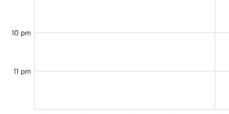
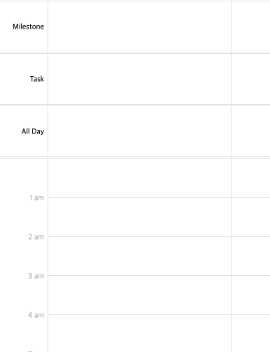
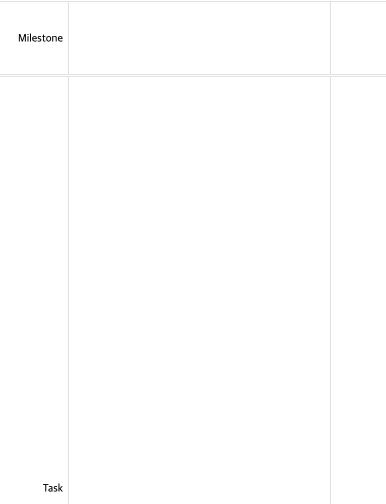
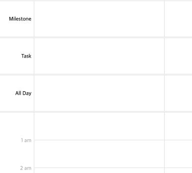
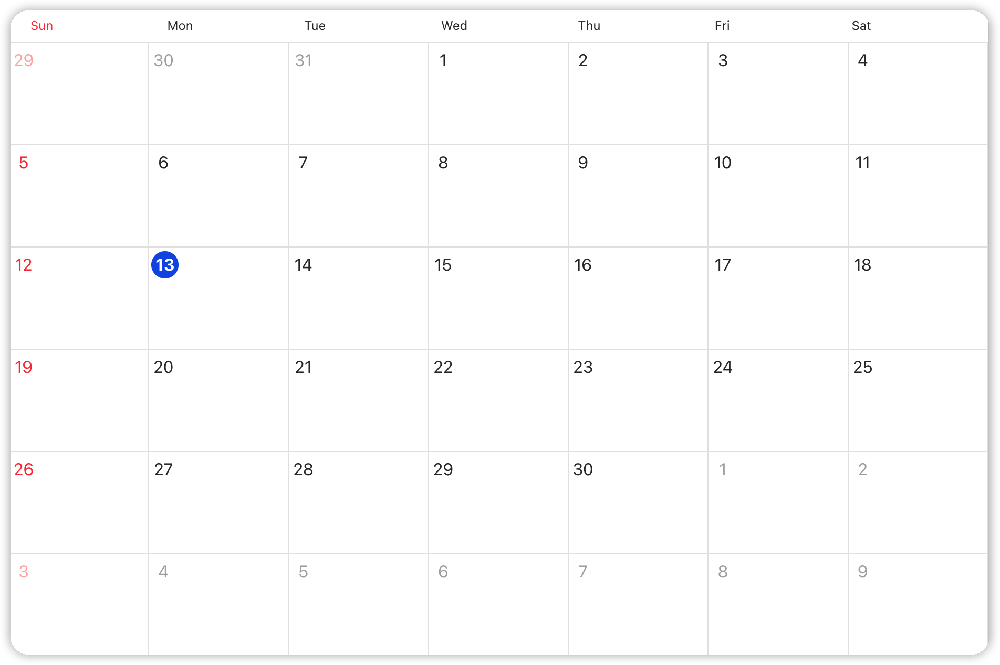
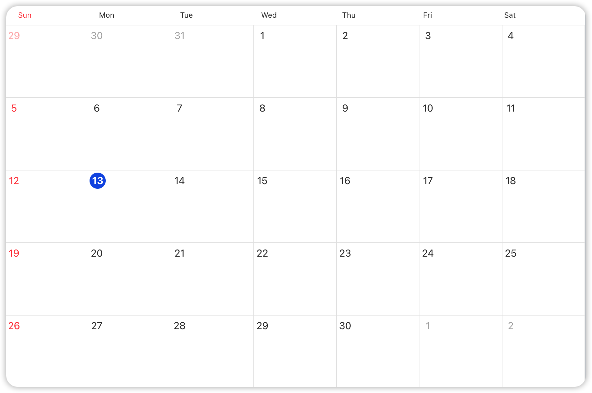
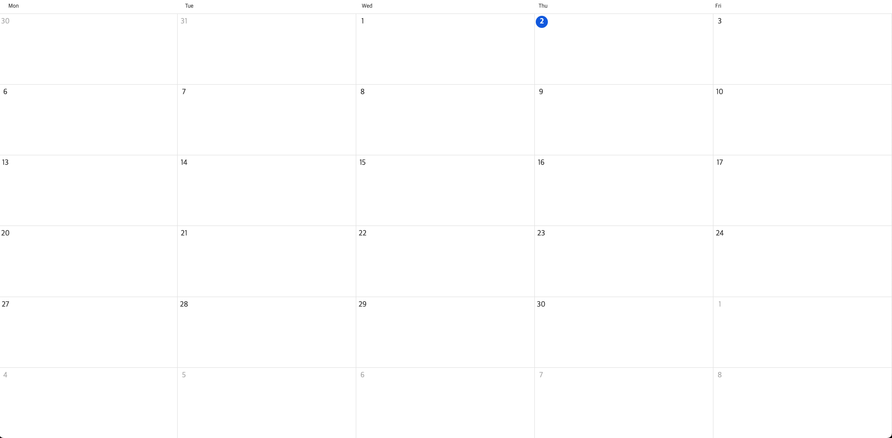
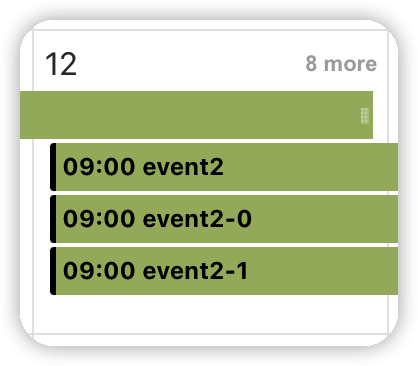

# 옵션

## 설명

옵션을 통해 캘린더를 다양하게 커스터마이징할 수 있다. 인스턴스를 생성할 때 넘기는 옵션 객체를 통해 변경할 수도 있고 `setOptions` 메서드를 통해서도 자유롭게 옵션을 변경할 수 있다.

```js
// 인스턴스를 생성하며 옵션 설정하기
const calendar = new Calendar('#container', {
  defaultView: 'month',
  isReadOnly: true,
  // ...
});

// 생성된 인스턴스의 옵션을 setOptions 메서드로 변경하기
calendar.setOptions({
  defaultView: 'week',
  isReadOnly: false,
  // ...
});
```

## 옵션 객체

옵션 객체는 아래의 프로퍼티를 가진 중첩 객체이다. 해당 프로퍼티명을 클릭하면 자세한 설명으로 이동한다.

| 프로퍼티                            | 기본값                                    | 설명                                                                                               |
| ----------------------------------- | ----------------------------------------- | -------------------------------------------------------------------------------------------------- |
| [defaultView](#defaultview)         | <code>'week'</code>                       | 기본 뷰 타입                                                                                       |
| [useFormPopup](#useformpopup)       | <code>false</code>                        | 기본으로 제공하는 일정 생성 팝업 사용 여부                                                         |
| [useDetailPopup](#usedetailpopup)   | <code>false</code>                        | 기본으로 제공하는 일정 상세 팝업 사용 여부                                                         |
| [isReadOnly](#isreadonly)           | <code>false</code>                        | 캘린더 전체의 읽기 전용 여부                                                                       |
| [usageStatistics](#usagestatistics) | <code>true</code>                         | [Google Analytics(GA)](https://analytics.google.com/analytics/web/)를 위한 hostname 수집 허락 여부 |
| [eventFilter](#eventfilter)         | <code>(event) => !!event.isVisible</code> | 캘린더 전체의 이벤트 필터링 조건                                                                   |
| [week](#week)                       | <code>DEFAULT_WEEK_OPTIONS</code>         | 주간/일간뷰 관련 옵션                                                                              |
| [month](#month)                     | <code>DEFAULT_MONTH_OPTIONS</code>        | 월간뷰 관련 옵션                                                                                   |
| [gridSelection](#gridselection)     | <code>true</code>                         | 날짜/시간 선택의 클릭/더블 클릭 가능 여부                                                          |
| [timezone](#timezone)               | <code>{ zones: [] }</code>                | 캘린더에서 사용하는 타임존 정보                                                                    |
| [theme](#theme)                     | <code>DEFAULT_THEME</code>                | [테마](./theme.md)                                                 |
| [template](#template)               | <code>DEFAULT_TEMPLATE</code>             | [템플릿](./template.md)                                             |
| [calendars](#calendars)             | <code>[]</code>                           | 캘린더에서 사용하는 캘린더 목록                                                                    |

## 사용 예시

### defaultView

- 타입: `'month' | 'week' | 'day'`
- 기본값: `'week'`

캘린더의 기본 뷰를 지정한다. 월간뷰, 주간뷰, 일간뷰를 지정할 수 있으며 각각 `'month'`, `'week'`, `'day'` 이다. 기본값은 `'week'`이다.

```js
const calendar = new Calendar('#container', {
  defaultView: 'month',
});
```

[⬆ 목록으로 돌아가기](#옵션-객체)

### useFormPopup

- 타입: `boolean`
- 기본값: `false`

캘린더에서 기본으로 제공하는 일정 생성 팝업을 사용할지 여부를 지정한다. 기본값은 `false`이다.

일정 생성 팝업을 사용할 때는 [`tui-date-picker`](https://github.com/nhn/tui.date-picker)와 [`tui-time-picker`](https://github.com/nhn/tui.time-picker)의 css 파일을 가져와야 스타일이 제대로 적용된다.

```sh
$ npm install tui-date-picker tui-time-picker
```

```js
// 일정 생성 팝업을 사용하기 위해 tui-date-picker와 tui-time-picker의 css 파일을 불러온다.
import 'tui-date-picker/dist/tui-date-picker.css';
import 'tui-time-picker/dist/tui-time-picker.css';

const calendar = new Calendar('#container', {
  useFormPopup: true,
});
```

[⬆ 목록으로 돌아가기](#옵션-객체)

### useDetailPopup

- 타입: `boolean`
- 기본값: `false`

캘린더에서 기본으로 제공하는 일정 상세 팝업을 사용할지 여부를 지정한다. 기본값은 `false`이다.

```js
const calendar = new Calendar('#container', {
  useDetailPopup: true,
});
```

[⬆ 목록으로 돌아가기](#옵션-객체)

### isReadOnly

- 타입: `boolean`
- 기본값: `false`

캘린더를 읽기 전용으로 만들지 여부를 지정한다. 기본값은 `false`이며 `true`로 설정하면 사용자는 캘린더의 일정을 생성하거나 수정할 수 없다.

```js
const calendar = new Calendar('#container', {
  isReadOnly: true,
});
```

[⬆ 목록으로 돌아가기](#옵션-객체)

### usageStatistics

- 타입: `boolean`
- 기본값: `true`

[Google Analytics(GA)](https://analytics.google.com/analytics/web/)를 위한 hostname 수집을 허용할지 여부를 지정한다. 기본값은 `true`이며 `false`로 설정하면 통계 수집을 하지 않는다.

[TOAST UI 캘린더](https://github.com/nhn/tui.calendar)는 [GA](https://analytics.google.com/analytics/web/)를 적용하여 오픈 소스 사용에 대한 통계를 수집하여 전 세계에서 얼마나 널리 사용되는지 확인한다.
이는 프로젝트의 향후 진행을 결정하는 중요한 지표 역할을 한다.
`location.hostname`(예를 들어 "ui.toast.com")을 수집하며 사용량에 대한 통계를 측정하기 위해서만 사용된다.

```js
const calendar = new Calendar('#container', {
  usageStatistics: false,
});
```

[⬆ 목록으로 돌아가기](#옵션-객체)

### eventFilter

- 타입: `(event: EventObject) => boolean`
- 기본값: `(event) => !!event.isVisible`

캘린더의 일정 필터링 조건을 지정한다. 기본값은 `(event) => !!event.isVisible`로 일정의 `isVisible` 속성이 `true`인 일정만 렌더링한다.

커스텀 이벤트 필터를 적용할 때 `isVisible`을 필터링하지 않을 경우 `isVisible: false`인 이벤트가 캘린더에 나타날 수 있다.

```js
const calendar = new Calendar('#container', {
  eventFilter: (event) => event.isVisible && event.isAllday,
});
```

[⬆ 목록으로 돌아가기](#옵션-객체)

### week

- 타입: `WeekOptions`
- 기본값: `DEFAULT_WEEK_OPTIONS`

```ts
type EventView = 'allday' | 'time';
type TaskView = 'milestone' | 'task';

interface WeekOptions {
  startDayOfWeek?: number;
  dayNames?: [string, string, string, string, string, string, string];
  narrowWeekend?: boolean;
  workweek?: boolean;
  showTimezoneCollapseButton?: boolean;
  timezonesCollapsed?: boolean;
  hourStart?: number;
  hourEnd?: number;
  eventView?: boolean | EventView[];
  taskView?: boolean | TaskView[];
}
```

```js
const DEFAULT_WEEK_OPTIONS = {
  startDayOfWeek: 0,
  dayNames: [],
  narrowWeekend: false,
  workweek: false,
  showTimezoneCollapseButton: false,
  timezonesCollapsed: false,
  hourStart: 0,
  hourEnd: 24,
  eventView: true,
  taskView: true,
};
```

일간/주간뷰와 관련된 옵션을 지정한다.

[⬆ 목록으로 돌아가기](#옵션-객체)

#### week.startDayOfWeek

- 타입: `number`
- 기본값: `0`

일간/주간뷰에서 주의 시작 요일을 지정한다. 기본값은 `0`으로 일요일부터 시작한다. `0`(일요일)부터 `6`(토요일)까지의 값을 지정할 수 있다.

| 값  | 요일   |
| --- | ------ |
| 0   | 일요일 |
| 1   | 월요일 |
| 2   | 화요일 |
| 3   | 수요일 |
| 4   | 목요일 |
| 5   | 금요일 |
| 6   | 토요일 |

```js
calendar.setOptions({
  week: {
    startDayOfWeek: 1,
  },
});
```

| 기본값 적용                                                             | 예제 적용                                                              |
| ----------------------------------------------------------------------- | ---------------------------------------------------------------------- |
|  |  |

[⬆ 목록으로 돌아가기](#week)

#### week.dayNames

- 타입: `[string, string, string, string, string, string, string]`
- 기본값: `[]`

일간/주간뷰에서 주의 요일명을 변경할 수 있다. 기본값은 `[]`이며, [startDayOfWeek](#week.startDayOfWeek)로 설정한 요일부터 시작한다.

이 옵션을 부여할 때는 반드시 일요일부터 월요일까지 모든 요일이 입력된 배열을 입력해야 한다. 각 요일의 인덱스는 `Date.prototype.getDay` 의 결과와 같다. ([참고](https://tc39.es/ecma262/multipage/numbers-and-dates.html#sec-week-day))

```js
calendar.setOptions({
  week: {
    dayNames: ['월', '화', '수', '목', '금', '토', '일'],
  },
});
```

| 기본값 적용  | 예제 적용    |
| ------------ | ------------ |
|  |  |

[⬆ 목록으로 돌아가기](#week)

#### week.narrowWeekend

- 타입: `boolean`
- 기본값: `false`

일간/주간뷰에서 주말의 너비를 좁게(기존 너비의 1/2) 할 수 있다. 기본값은 `false`이며, 주말의 너비를 좁게 하려면 `true`로 지정한다.

```js
calendar.setOptions({
  week: {
    narrowWeekend: true,
  },
});
```

| 기본값 적용                                                           | 예제 적용                                                            |
| --------------------------------------------------------------------- | -------------------------------------------------------------------- |
|  |  |

[⬆ 목록으로 돌아가기](#week)

#### week.workweek

- 타입: `boolean`
- 기본값: `false`

일간/주간뷰에서 주말을 제외할 수 있다. 기본값은 `false`이며, 주말을 제외하려면 `true`로 지정한다.

```js
calendar.setOptions({
  week: {
    workweek: true,
  },
});
```

| 기본값 적용                                                 | 예제 적용                                                  |
| ----------------------------------------------------------- | ---------------------------------------------------------- |
|  |  |

[⬆ 목록으로 돌아가기](#week)

#### week.showTimezoneCollapseButton

- 타입: `boolean`
- 기본값: `false`

주간/일간뷰에서 여러 타임존을 사용할 때, 서브 타임존을 접는 버튼을 표시할지 여부를 지정할 수 있다. 기본값은 `false`이며, 접기 버튼을 표시하려면 `true`로 지정한다.

```js
calendar.setOptions({
  week: {
    showTimezoneCollapseButton: true,
  },
});
```

| 기본값 적용                                                                                     | 예제 적용                                                                                      |
| ----------------------------------------------------------------------------------------------- | ---------------------------------------------------------------------------------------------- |
|  |  |

[⬆ 목록으로 돌아가기](#week)

#### week.timezonesCollapsed

- 타입: `boolean`
- 기본값: `false`

주간/일간뷰에서 여러 타임존을 사용할 때, 서브 타임존들을 접힌 상태로 표시할지 여부를 지정한다. 기본값은 `false`이며, 접힌 상태로 표시하려면 `true`로 지정한다.

```js
calendar.setOptions({
  week: {
    timezonesCollapsed: true,
  },
});
```

| 기본값 적용                                                                     | 예제 적용                                                                      |
| ------------------------------------------------------------------------------- | ------------------------------------------------------------------------------ |
|  |  |

[⬆ 목록으로 돌아가기](#week)

#### week.hourStart

- 타입: `number`
- 기본값: `0`

주간/일간뷰에서 각 컬럼의 시작 시간을 지정한다. 기본값은 `0`이며, 원하는 시작 시간을 지정할 수 있다.

```js
calendar.setOptions({
  week: {
    hourStart: 9,
  },
});
```

| 기본값 적용                                                   | 예제 적용                                                    |
| ------------------------------------------------------------- | ------------------------------------------------------------ |
|  |  |

[⬆ 목록으로 돌아가기](#week)

#### week.hourEnd

- 타입: `number`
- 기본값: `24`

주간/일간뷰에서 각 컬럼의 끝 시간을 지정한다. 기본값은 `24`이며, 원하는 끝 시간을 지정할 수 있다.

```js
calendar.setOptions({
  week: {
    hourEnd: 18,
  },
});
```

| 기본값 적용                                               | 예제 적용                                                |
| --------------------------------------------------------- | -------------------------------------------------------- |
|  |  |

[⬆ 목록으로 돌아가기](#week)

#### week.eventView

- 타입: `boolean | ('allday' | 'time')[]`
- 기본값: `true`

주간/일간뷰에서 allday 패널과 time 패널의 표시 여부를 지정할 수 있다. 기본값은 `true`이며, allday 패널과 time 패널을 모두 표시한다. `false`인 경우엔 두 패널 모두 표시하지 않으며, `['allday']`인 경우엔 allday 패널만 표시한다. `['time']`인 경우엔 time 패널만 표시한다.

```js
calendar.setOptions({
  week: {
    eventView: false,
  },
});
```

| 기본값 적용                                                   | 예제 적용                                                    |
| ------------------------------------------------------------- | ------------------------------------------------------------ |
|  |  |

[⬆ 목록으로 돌아가기](#week)

#### week.taskView

- 타입: `boolean | ('milestone' | 'task')[]`
- 기본값: `true`

주간/일간뷰에서 milestone 패널과 task 패널의 표시 여부를 지정할 수 있다. 기본값은 `true`이며, milestone 패널과 task 패널을 모두 표시한다. `false`인 경우엔 두 패널 모두 표시하지 않으며, `['milestone']`인 경우엔 milestone 패널만 표시한다. `['task']`인 경우엔 task 패널만 표시한다.

```js
calendar.setOptions({
  week: {
    taskView: false,
  },
});
```

| 기본값 적용                                                 | 예제 적용                                                  |
| ----------------------------------------------------------- | ---------------------------------------------------------- |
|  |  |

[⬆ 목록으로 돌아가기](#week)

### month

- 타입: `MonthOptions`
- 기본값: `DEFAULT_MONTH_OPTIONS`

```ts
interface MonthOptions {
  dayNames?: [string, string, string, string, string, string, string];
  startDayOfWeek?: number;
  narrowWeekend?: boolean;
  visibleWeeksCount?: number;
  isAlways6Weeks?: boolean;
  workweek?: boolean;
  visibleEventCount?: number;
}
```

```js
const DEFAULT_MONTH_OPTIONS = {
  dayNames: ['sun', 'mon', 'tue', 'wed', 'thu', 'fri', 'sat'],
  visibleWeeksCount: 0,
  workweek: false,
  narrowWeekend: false,
  startDayOfWeek: 0,
  isAlways6Weeks: true,
  visibleEventCount: 6,
};
```

월간뷰와 관련된 옵션을 지정한다.

[⬆ 목록으로 돌아가기](#옵션-객체)

#### month.dayNames

- 타입: `[string, string, string, string, string, string, string]`
- 기본값: `['sun', 'mon', 'tue', 'wed', 'thu', 'fri', 'sat']`

월간뷰에서 주의 요일명을 변경할 수 있다. 기본값은 `['sun', 'mon', 'tue', 'wed', 'thu', 'fri', 'sat']`이며, [startDayOfWeek](#month.startDayOfWeek)로 설정한 요일부터 시작한다.

이 옵션을 부여할 때는 반드시 일요일부터 월요일까지 모든 요일이 입력된 배열을 입력해야 한다. 각 요일의 인덱스는 `Date.prototype.getDay` 의 결과와 같다. ([참고](https://tc39.es/ecma262/multipage/numbers-and-dates.html#sec-week-day))

| 값  | 요일   |
| --- | ------ |
| 0   | 일요일 |
| 1   | 월요일 |
| 2   | 화요일 |
| 3   | 수요일 |
| 4   | 목요일 |
| 5   | 금요일 |
| 6   | 토요일 |

```js
calendar.setOptions({
  month: {
    dayNames: ['일', '월', '화', '수', '목', '금', '토'],
  },
});
```

| 기본값 적용  | 예제 적용    |
| ------------ | ------------ |
|  |  |

[⬆ 목록으로 돌아가기](#month)

#### month.startDayOfWeek

- 타입: `number`
- 기본값: `0`

월간뷰에서 주의 시작 요일을 지정한다. 기본값은 `0`으로 일요일부터 시작한다. `0`(일요일)부터 `6`(토요일)까지의 값을 지정할 수 있다.

각 요일의 인덱스는 `Date.prototype.getDay` 의 결과와 같다. ([참고](https://tc39.es/ecma262/multipage/numbers-and-dates.html#sec-week-day))

| 값  | 요일   |
| --- | ------ |
| 0   | 일요일 |
| 1   | 월요일 |
| 2   | 화요일 |
| 3   | 수요일 |
| 4   | 목요일 |
| 5   | 금요일 |
| 6   | 토요일 |

```js
calendar.setOptions({
  month: {
    startDayOfWeek: 1,
  },
});
```

| 기본값 적용                                                               | 예제 적용                                                                |
| ------------------------------------------------------------------------- | ------------------------------------------------------------------------ |
|  |  |

[⬆ 목록으로 돌아가기](#month)

#### month.narrowWeekend

- 타입: `boolean`
- 기본값: `false`

월간뷰에서 주말의 너비를 좁게(기존 너비의 1/2) 할 수 있다. 기본값은 `false`이며, 주말의 너비를 좁게 하려면 `true`로 지정한다.

```js
calendar.setOptions({
  month: {
    narrowWeekend: true,
  },
});
```

| 기본값 적용                                                             | 예제 적용                                                              |
| ----------------------------------------------------------------------- | ---------------------------------------------------------------------- |
|  |  |

[⬆ 목록으로 돌아가기](#month)

#### month.visibleWeeksCount

- 타입: `number`
- 기본값: `0`

월간뷰에서 보여지는 주의 개수를 지정한다. 기본값은 `0`이며 6주를 표시한다. 다른 주의 개수를 지정하려면 `1`부터 `6`까지의 값을 지정할 수 있다.

⚠️ 이 옵션을 설정하면 현재 날짜는 무조건 첫 주에 위치하게 된다.

```js
calendar.setOptions({
  month: {
    visibleWeeksCount: 2,
  },
});
```

| 기본값 적용                                                                     | 예제 적용                                                                      |
| ------------------------------------------------------------------------------- | ------------------------------------------------------------------------------ |
|  |  |

[⬆ 목록으로 돌아가기](#month)

#### month.isAlways6Weeks

- 타입: `boolean`
- 기본값: `true`

월간 뷰에서 항상 6주 단위로 캘린더를 표시할지 여부를 결정한다. 기본값은 `true`이며 표시하고 있는 월의 전체 주 수와 관계 없이 6주를 표시한다.

`false`로 지정하면 해당 월의 표시 가능한 주 수에 따라 4~6주로 표시된다.

```js
calendar.setOptions({
  month: {
    isAlways6Weeks: false,
  },
});
```

| 기본값 적용  | 예제 적용    |
| ------------ | ------------ |
|  |  |

[⬆ 목록으로 돌아가기](#month)

#### month.workweek

- 타입: `boolean`
- 기본값: `false`

월간뷰에서 주말을 제외할 수 있다. 기본값은 `false`이며, 주말을 제외하려면 `true`로 지정한다.

```js
calendar.setOptions({
  month: {
    workweek: true,
  },
});
```

| 기본값 적용                                                   | 예제 적용                                                    |
| ------------------------------------------------------------- | ------------------------------------------------------------ |
|  |  |

[⬆ 목록으로 돌아가기](#month)

#### month.visibleEventCount

- 타입: `number`
- 기본값: `6`

월간뷰에서 각 날짜별 최대로 보여지는 일정의 갯수를 지정한다. 기본값은 `6` 이다.

이 옵션에서 지정한 갯수만큼 일정을 표시하려 하지만 높이가 충분하지 못할 경우 자동으로 옵션이 무시된다.

캘린더 전체 영역과 [month 테마의 gridCell 속성](./theme.md#month-gridcell)의 영향을 받는다.

```js
calendar.setOptions({
  month: {
    visibleEventCount: 2,
  },
});
```

| 기본값 적용  | 예제 적용    |
| ------------ | ------------ |
|  |  |

[⬆ 목록으로 돌아가기](#month)

### gridSelection

- 타입: `boolean | GridSelectionOptions`
- 기본값: `true`

```ts
interface GridSelectionOptions {
  enableDblClick?: boolean;
  enableClick?: boolean;
}
```

캘린더의 날짜/시간을 선택할 때 클릭과 더블 클릭의 가능 여부를 지정한다. 기본값은 `true`이다. `true`나 `false`의 `boolean` 타입으로 지정하면 클릭과 더블 클릭이 둘 모두 가능하거나 불가능하게 만든다.
`{ enableDblClick: boolean; enableClick: boolean }`로 지정하면 클릭과 더블 클릭을 각각 지정할 수도 있다.

```js
const calendar = new Calendar('#container', {
  gridSelection: {
    enableDblClick: false,
    enableClick: true,
  },
});
```

[⬆ 목록으로 돌아가기](#옵션-객체)

### timezone

- 타입: `TimezoneOptions`
- 기본값: `{ zones: [] }`

⚠️ 타임존 기능을 이용하기 위해서는 `Intl.DateTimeFormat` API 뿐 아니라 IANA 타임존 데이터베이스를 지원하는 모던 브라우저가 필요하다.
⚠️ Internet Explorer 11을 지원해야 한다면 폴리필을 적용하거나, 별도의 라이브러리와 함께 `customOffsetCalculator` 옵션을 사용해야 한다.

- [지원 범위 (caniuse)](https://caniuse.com/mdn-javascript_builtins_date_tolocaletimestring_iana_time_zone_names)
- [`Intl.DateTimeFormat` 폴리필](https://formatjs.io/docs/polyfills/intl-datetimeformat/)

```ts
interface TimezoneConfig {
  timezoneName: string;
  displayLabel?: string;
  tooltip?: string;
}

interface TimezoneOptions {
  zones?: TimezoneConfig[];
  customOffsetCalculator?: (timezoneName: string, timestamp: number) => number;
}
```

#### 기본 타임존 설정

캘린더에서 사용되는 타임존 정보를 지정한다. 기본값은 `{ zones: [] }`이다. `zones`는 각 타임존 정보들의 배열이며 타임존 정보는 해당 타임존의 이름(`timezoneName`)과 주간/일간 뷰에서 사용되는 표시 라벨(`displayLabel`), 툴팁(`tooltip`)을 지정할 수 있다.

타임존 정보 배열의 한 개 이상의 타임존 정보가 설정된 경우 해당 캘린더는 배열의 첫 번째 요소를 기본 타임존으로 설정한다.

```js
// 브라우저가 구동되는 시스템의 타임존과 상관 없이 기본 타임존을 런던으로 설정
const calendar = new Calendar('#container', {
  timezone: {
    zones: [
      {
        timezoneName: 'Europe/London',
      },
    ],
  },
});
```

타임존이 두 개 이상 설정되었고, 주간/일간 뷰를 표시하는 상태라면 좌측 시간 라인에 표시 라벨과 툴팁이 표시된다. 그 외에는 영향을 미치지 않는다.


#### 사용자 정의 오프셋 계산

`customOffsetCalculator`는 사용자가 직접 정의한 방식으로 주어진 타임존과 UTC와의 차이를 계산하여 분 단위로 리턴해야 한다. 예를 들어 타임존 이름이 `'Asia/Seoul'` 이라면 `UTC +9` 이므로 `540`이 리턴되어야 하는 것이다.

만약 `customOffsetCalculator` 가 정의되어 있다면 캘린더는 타임존이 계산되는 모든 로직에 이 계산 함수를 사용한다. 그렇지 않다면 기본적으로 [`Intl.DateTimeFormat` API](https://developer.mozilla.org/en-US/docs/Web/JavaScript/Reference/Global_Objects/Intl/DateTimeFormat)를 활용하기 때문에 굳이 별도의 옵션을 정의할 필요가 없다.

구형 브라우저를 지원하기 위해 별도의 라이브러리를 사용하는 등 특수한 경우가 아니라면 `customOffsetCalculator` 옵션을 사용하지 않는 것을 추천한다.

```js
// moment timezone을 사용하여 오프셋 계산
function momentTZCalculator(timezoneName, timestamp) {
  return moment.tz(timezoneName).utcOffset(timestamp);
}

// Luxon을 사용하여 오프셋 계산
function luxonTZCalculator(timezoneName, timestamp) {
  return DateTime.fromMillis(timestamp).setZone(timezoneName).offset;
}

// date-fns-tz를 사용하여 오프셋 계산
function dateFnsTZCalculator(timezoneName, timestamp) {
  return getTimezoneOffset(timezoneName, new Date(timestamp));
}

// ...

const calendar = new Calendar('#container', {
  timezone: {
    zones: [
      {
        timezoneName: 'Asia/Seoul',
        displayLabel: 'Seoul',
        tooltip: 'Seoul Time',
      },
      {
        timezoneName: 'Asia/Tokyo',
        displayLabel: 'Tokyo',
        tooltip: 'Tokyo Time',
      },
    ],
    customOffsetCalculator: momentTZCalculator, // 혹은 luxonTZCalculator, dateFnsTZCalculator
  },
});
```

[⬆ 목록으로 돌아가기](#옵션-객체)

### theme

- 타입: `ThemeObject`
- 기본값: `DEFAULT_THEME`

캘린더의 테마를 지정한다. 캘린더 인스턴스 생성 시에만 적용할 수 있으며 `setOptions` 메서드로는 변경이 불가능하다. 대신 `setTheme` 메서드로 변경 가능하며 자세한 내용은 [테마 문서](./theme.md)에서 확인할 수 있다.

[⬆ 목록으로 돌아가기](#옵션-객체)

### template

- 타입: `TemplateObject`
- 기본값: `DEFAULT_TEMPLATE`

캘린더의 템플릿을 지정한다. 자세한 내용은 [템플릿 문서](./template.md)에서 확인할 수 있다.

[⬆ 목록으로 돌아가기](#옵션-객체)

### calendars

- 타입: `CalendarInfo[]`
- 기본값: `[]`

캘린더에서 사용되는 캘린더 목록을 지정한다. 캘린더 목록의 각 캘린더 정보는 해당 캘린더의 `id`와 캘린더명, 색상 정보를 가지고 있다. 기본값은 `[]`이다. 캘린더 정보에 대한 자세한 설명은 [EventObject 문서](./event-object.md#캘린더calendarid)를 참고한다.

```ts
interface CalendarInfo {
  id: string;
  name: string;
  color?: string;
  backgroundColor?: string;
  dragBackgroundColor?: string;
  borderColor?: string;
}
```

[⬆ 목록으로 돌아가기](#옵션-객체)
