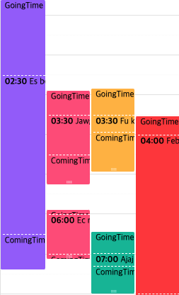
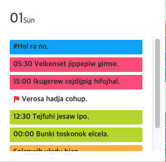
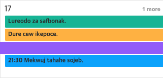
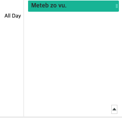
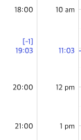
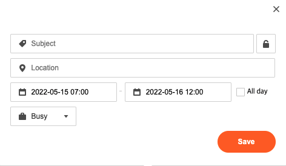
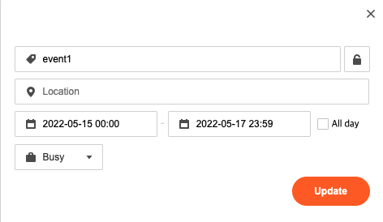
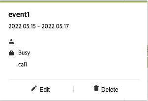

# 템플릿

## 설명

템플릿은 커스텀 렌더링을 지원하는 기능이다. 캘린더 인스턴스 생성 시 템플릿 옵션으로 커스텀 렌더링을 할 수 있으며, `setOptions`로 템플릿 옵션을 변경할 수 있다.

```js
const calendar = new Calendar('#container', {
  template: {
    milestone(event) {
      return `<span style="color: red;">${event.title}</span>`;
    },
  },
});

calendar.setOptions({
  template: {
    milestone(event) {
      return `<span style="color: blue;">${event.title}</span>`;
    },
  },
});
```

## 템플릿 목록

템플릿의 각 프로퍼티들은 문자열 또는 `preact`의 VNode를 반환하는 함수이며 파라미터는 템플릿의 종류에 따라 다르다. 아래는 전체 템플릿 목록이다.

| 템플릿명                                                  | 파라미터                                                         | 설명                                                               |
| --------------------------------------------------------- | ---------------------------------------------------------------- | ------------------------------------------------------------------ |
| [milestone](#milestone)                                   | [EventObject](./event-object.md) | 주간/일간뷰의 milestone 이벤트                                     |
| [milestoneTitle](#milestonetitle)                         | 없음                                                             | 주간/일간뷰의 milestone 패널의 왼쪽 영역                           |
| [task](#task)                                             | [EventObject](./event-object.md) | 주간/일간뷰의 task 이벤트                                          |
| [taskTitle](#tasktitle)                                   | 없음                                                             | 주간/일간뷰의 task 패널의 왼쪽 영역                                |
| [allday](#allday)                                         | [EventObject](./event-object.md) | 주간/일간뷰의 allday 이벤트                                        |
| [alldayTitle](#alldaytitle)                               | 없음                                                             | 주간/일간뷰의 allday 패널의 왼쪽 영역                              |
| [time](#time)                                             | [EventObject](./event-object.md) | 주간/일간뷰의 timed 이벤트                                         |
| [goingDuration](#goingduration)                           | [EventObject](./event-object.md) | 주간/일간뷰의 timed 이벤트의 일정 장소까지 이동 시간               |
| [comingDuration](#comingduration)                         | [EventObject](./event-object.md) | 주간/일간뷰의 timed 이벤트의 복귀 시간                             |
| [monthMoreTitleDate](#monthmoretitledate)                 | TemplateMoreTitleDate                                            | 월간뷰의 더 보기 팝업의 날짜                                       |
| [monthMoreClose](#monthmoreclose)                         | 없음                                                             | 월간뷰의 더 보기 팝업의 닫기 버튼                                  |
| [monthGridHeader](#monthgridheader)                       | TemplateMonthGrid                                                | 월간뷰의 셀의 헤더 영역                                            |
| [monthGridHeaderExceed](#monthgridheaderexceed)           | <code>number</code>                                              | 월간뷰의 셀의 헤더 영역의 초과되는 이벤트 갯수를 표시하는 컴포넌트 |
| [monthGridFooter](#monthgridfooter)                       | TemplateMonthGrid                                                | 월간뷰의 셀의 푸터 영역                                            |
| [monthGridFooterExceed](#monthgridfooterexceed)           | <code>number</code>                                              | 월간뷰의 셀의 푸터 영역의 초과되는 이벤트 갯수를 표시하는 컴포넌트 |
| [monthDayName](#monthdayname)                             | TemplateMonthDayName                                             | 월간뷰의 요일                                                      |
| [weekDayName](#weekdayname)                               | TemplateWeekDayName                                              | 주간/일간뷰의 요일                                                 |
| [weekGridFooterExceed](#weekgridfooterexceed)             | <code>number</code>                                              | 주간/일간뷰의 allday 패널의 초과된 이벤트 표시 컴포넌트            |
| [collapseBtnTitle](#collapsebtntitle)                     | 없음                                                             | 주간/일간뷰의 allday 패널의 접기 버튼 컴포넌트                     |
| [timezoneDisplayLabel](#timezonedisplaylabel)             | TemplateTimezone                                                 | 주간/일간뷰의 타임존 표시 컴포넌트                                 |
| [timegridDisplayPrimaryTime](#timegriddisplayprimarytime) | TemplateNow                                              | 주간/일간뷰의 primary 타임존 시간 표시                             |
| [timegridDisplayTime](#timegriddisplaytime)               | TemplateNow                                              | 주간/일간뷰의 primary 타임존 외의 타임존 시간 표시                 |
| [timegridNowIndicatorLabel](#timegridnowindicatorlabel)               | TemplateNow                                              | 주간/일간뷰의 현재 시간 표시                                       |
| [popupIsAllday](#popupisallday)                           | 없음                                                             | 이벤트 폼 팝업에서 all day 텍스트                                |
| [popupStateFree](#popupstatefree)                         | 없음                                                             | 이벤트 폼 팝업에서 이벤트 한가함(free) 상태 텍스트               |
| [popupStateBusy](#popupstatebusy)                         | 없음                                                             | 이벤트 폼 팝업에서 이벤트 바쁨(busy) 상태 텍스트                 |
| [titlePlaceholder](#titleplaceholder)                     | 없음                                                             | 이벤트 폼 팝업에서 이벤트명 placeholder                          |
| [locationPlaceholder](#locationplaceholder)               | 없음                                                             | 이벤트 폼 팝업에서 이벤트 장소 placeholder                       |
| [startDatePlaceholder](#startdateplaceholder)             | 없음                                                             | 이벤트 폼 팝업에서 이벤트 시작 날짜 placeholder                  |
| [endDatePlaceholder](#enddateplaceholder)                 | 없음                                                             | 이벤트 폼 팝업에서 이벤트 종료 날짜 placeholder                  |
| [popupSave](#popupsave)                                   | 없음                                                             | 이벤트 폼 팝업에서 저장 버튼 텍스트                              |
| [popupUpdate](#popupupdate)                               | 없음                                                             | 이벤트 수정 팝업에서 수정 버튼 텍스트                              |
| [popupEdit](#popupedit)                                   | 없음                                                             | 이벤트 상세 팝업에서 편집 버튼 텍스트                              |
| [popupDelete](#popupdelete)                               | 없음                                                             | 이벤트 상세 팝업에서 삭제 버튼 텍스트                              |
| [popupDetailTitle](#popupdetailtitle)                     | [EventObject](./event-object.md) | 이벤트 상세 팝업에서 이벤트명                                      |
| [popupDetailDate](#popupdetaildate)                       | [EventObject](./event-object.md) | 이벤트 상세 팝업에서 이벤트의 기간                                 |
| [popupDetailLocation](#popupdetaillocation)               | [EventObject](./event-object.md) | 이벤트 상세 팝업에서 이벤트의 장소                                 |
| [popupDetailAttendees](#popupdetailattendees)             | [EventObject](./event-object.md) | 이벤트 상세 팝업에서 이벤트의 참석자                               |
| [popupDetailState](#popupdetailstate)                     | [EventObject](./event-object.md) | 이벤트 상세 팝업에서 이벤트의 상태                                 |
| [popupDetailRecurrenceRule](#popupdetailrecurrencerule)   | [EventObject](./event-object.md) | 이벤트 상세 팝업에서 이벤트의 반복 룰                              |
| [popupDetailBody](#popupdetailbody)                       | [EventObject](./event-object.md) | 이벤트 상세 팝업에서 이벤트의 내용                                 |

## 사용 예시

### milestone 패널


#### milestone

[`EventObject`](./event-object.md) 파라미터를 이용해 주간/일간뷰의 milestone 이벤트를 커스터마이징할 수 있다.

```js
calendar.setOptions({
  template: {
    milestone(event) {
      return `<span style:"color: blue;">${event.title}</span>`;
    },
  },
});
```

[⬆ 목록으로 돌아가기](#템플릿-목록)

#### milestoneTitle

주간/일간뷰의 milestone 패널 왼쪽의 영역을 커스터마이징할 수 있다.

```js
calendar.setOptions({
  template: {
    milestoneTitle() {
      return `<span>Milestone events</span>`;
    },
  },
});
```

[⬆ 목록으로 돌아가기](#템플릿-목록)

### task 패널


#### task

[`EventObject`](./event-object.md) 파라미터를 이용해 주간/일간뷰의 task 이벤트를 커스터마이징할 수 있다.

```js
calendar.setOptions({
  template: {
    task(event) {
      return `<span style="color: red;">${event.title}</span>`;
    },
  },
});
```

[⬆ 목록으로 돌아가기](#템플릿-목록)

#### taskTitle

주간/일간뷰의 task 패널 왼쪽의 영역을 커스터마이징할 수 있다.

```js
calendar.setOptions({
  template: {
    taskTitle() {
      return `<span>Task events</span>`;
    },
  },
});
```

[⬆ 목록으로 돌아가기](#템플릿-목록)

### allday 패널


#### allday

[`EventObject`](./event-object.md) 파라미터를 이용해 주간/일간뷰의 allday 이벤트를 커스터마이징할 수 있다.

```js
calendar.setOptions({
  template: {
    allday(event) {
      return `<span style="color: green;">${event.title}</span>`;
    },
  },
});
```

[⬆ 목록으로 돌아가기](#템플릿-목록)

#### alldayTitle

주간/일간뷰의 allday 패널 왼쪽의 영역을 커스터마이징할 수 있다.

```js
calendar.setOptions({
  template: {
    allday() {
      return `<span>Allday events</span>`;
    },
  },
});
```

[⬆ 목록으로 돌아가기](#템플릿-목록)

### timed 이벤트



#### time

[`EventObject`](./event-object.md) 파라미터를 이용해 주간/일간뷰의 timed 이벤트를 커스터마이징할 수 있다. 이동 시간 및 복귀 시간을 제외한 부분이다.

```js
calendar.setOptions({
  template: {
    time(event) {
      return `<span style="color: black;">${event.title}</span>`;
    },
  },
});
```

[⬆ 목록으로 돌아가기](#템플릿-목록)

#### goingDuration

[`EventObject`](./event-object.md) 파라미터를 이용해 주간/일간뷰에서 timed 이벤트의 일정 장소까지 이동 시간을 커스터마이징할 수 있다.

```js
calendar.setOptions({
  template: {
    goingDuration(event) {
      return `<span>${event.goingDuration}</span>`;
    },
  },
});
```

[⬆ 목록으로 돌아가기](#템플릿-목록)

#### comingDuration

[`EventObject`](./event-object.md) 파라미터를 이용해 주간/일간뷰에서 timed 이벤트의 복귀 시간을 커스터마이징할 수 있다.

```js
calendar.setOptions({
  template: {
    comingDuration(event) {
      return `<span>${event.comingDuration}</span>`;
    },
  },
});
```

[⬆ 목록으로 돌아가기](#템플릿-목록)

### 월간뷰의 더보기 팝업



#### monthMoreTitleDate

```ts
interface TemplateMoreTitleDate {
  ymd: string; // 해당 날짜의 `YYYY-MM-DD` 문자열 형식 데이터
  date: number; // 해당 날짜의 일
  day: number; // 해당 날짜의 요일
}
```

더 보기 팝업의 날짜를 커스터마이징할 수 있다.

```js
calendar.setOptions({
  template: {
    monthMoreTitleDate(moreTitle) {
      const { date } = moreTitle;

      return `<span>${date}</span>`;
    },
  },
});
```

[⬆ 목록으로 돌아가기](#템플릿-목록)

#### monthMoreClose

더 보기 팝업의 닫기 버튼을 커스터마이징할 수 있다. 기본적으로는 닫기 버튼이 표시되지 않는다.

```js
calendar.setOptions({
  template: {
    monthMoreClose() {
      return '';
    },
  },
});
```

[⬆ 목록으로 돌아가기](#템플릿-목록)

### 월간뷰의 헤더와 푸터



```ts
interface TemplateMonthGrid {
  date: string; // 해당 날짜의 일
  day: number; // 해당 날짜의 요일
  hiddenEventCount: number; // 표시되지 않은 이벤트의 갯수
  isOtherMonth: boolean; // 현재 월간뷰의 달과 다른 달의 날짜인지 여부
  isToday: boolean; // 오늘 날짜인지 여부
  month: number; // 해당 월
  ymd: string; // 해당 날짜의 `YYYY-MM-DD` 문자열 형식 데이터
}
```

#### monthGridHeader

월간뷰 셀의 헤더 영역을 커스터마이징할 수 있다. `TemplateMonthGrid` 객체를 파라미터로 받는다.

```js
calendar.setOptions({
  template: {
    monthGridHeader(model) {
      const date = parseInt(model.date.split('-')[2], 10);

      return `<span>${date}</span>`;
    },
  },
});
```

[⬆ 목록으로 돌아가기](#템플릿-목록)

#### monthGridHeaderExceed

월간뷰 셀의 헤더 영역의 초과되는 이벤트의 갯수를 표시하는 컴포넌트를 커스터마이징할 수 있다. 초과된 이벤트의 갯수를 파라미터로 받는다.

```js
calendar.setOptions({
  template: {
    monthGridHeaderExceed(hiddenEvents) {
      return `<span>${hiddenEvents} more</span>`;
    },
  },
});
```

[⬆ 목록으로 돌아가기](#템플릿-목록)

#### monthGridFooter

월간뷰 셀의 푸터 영역을 커스터마이징할 수 있다. `TemplateMonthGrid` 객체를 파라미터로 받는다.
기본적으로는 아무 것도 표시되지 않는다.

```js
calendar.setOptions({
  template: {
    monthGridFooter() {
      return '';
    },
  },
});
```

[⬆ 목록으로 돌아가기](#템플릿-목록)

#### monthGridFooterExceed

월간뷰 셀의 푸터 영역의 초과되는 이벤트의 갯수를 표시하는 컴포넌트를 커스터마이징할 수 있다. 초과된 이벤트의 갯수를 파라미터로 받는다.
기본적으로는 아무 것도 표시되지 않는다.

```js
calendar.setOptions({
  template: {
    monthGridFooterExceed() {
      return '';
    },
  },
});
```

[⬆ 목록으로 돌아가기](#템플릿-목록)

### 요일 표시

#### monthDayName


```ts
interface TemplateMonthDayName {
  day: number; // 해당 날짜의 요일
  label: string; // 해당 요일의 기본적인 영문 축약형 문자열
}
```

월간뷰의 요일을 커스터마이징할 수 있다.

```js
calendar.setOptions({
  template: {
    monthDayName(model) {
      return model.label;
    },
  },
});
```

[⬆ 목록으로 돌아가기](#템플릿-목록)

#### weekDayName


```ts
interface TemplateWeekDayName {
  date: number; // 해당 요일의 일
  day: number; // 해당 요일
  dayName: string; // 해당 요일의 기본적인 영문 축약형 문자열
  isToday: boolean; // 해당 요일이 오늘인지 여부
  renderDate: string; // 주간/일간뷰 렌더링의 기준 날짜
  dateInstance: TZDate; // 해당 요일의 `Date` 객체
}
```

주간/일간뷰의 요일을 커스터마이징할 수 있다.

```js
calendar.setOptions({
  template: {
    weekDayName(model) {
      return `<span>${model.date}</span>&nbsp;&nbsp;<span>${model.dayName}</span>`;
    },
  },
});
```

[⬆ 목록으로 돌아가기](#템플릿-목록)

### weekGridFooterExceed


주간/일간뷰의 allday 패널의 초과된 이벤트 표시 컴포넌트를 커스터마이징할 수 있다. 초과된 이벤트의 갯수를 파라미터로 받는다.

```js
calendar.setOptions({
  template: {
    weekGridFooterExceed(hiddenEvents) {
      return `+${hiddenEvents}`;
    },
  },
});
```

[⬆ 목록으로 돌아가기](#템플릿-목록)

### collapseBtnTitle



주간/일간뷰의 접기 버튼 컴포넌트를 커스터마이징할 수 있다.

```js
calendar.setOptions({
  template: {
    collapseBtnTitle() {
      return `<span>↑</span>`;
    },
  },
});
```

[⬆ 목록으로 돌아가기](#템플릿-목록)

### timezoneDisplayLabel


2개 이상의 타임존을 사용하는 주간/일간뷰에서 타임존을 표시하는 컴포넌트를 커스터마이징할 수 있다.

```js
calendar.setOptions({
  template: {
    timezoneDisplayLabel({ timezoneOffset }) {
      const sign = timezoneOffset < 0 ? '-' : '+';
      const hours = Math.abs(timezoneOffset / 60);
      const minutes = Math.abs(timezoneOffset % 60);

      return `GMT${sign}${hours}:${minutes}`;
    },
  },
});
```

[⬆ 목록으로 돌아가기](#템플릿-목록)

### 시간 표시



```ts
type TimeUnit = 'second' | 'minute' | 'hour' | 'date' | 'month' | 'year';

interface TemplateNow {
  unit: TimeUnit; // 시간의 단위
  time: TZDate; // 해당 시간
  format: string; // 해당 시간의 포맷
}
```

[⬆ 목록으로 돌아가기](#템플릿-목록)

#### timegridDisplayPrimaryTime

primary 타임존의 시간 표시를 커스터마이징할 수 있다.

```js
calendar.setOptions({
  template: {
    timegridDisplayPrimaryTime({ time }) {
      return `primary timezone: ${time}`;
    },
  },
});
```

[⬆ 목록으로 돌아가기](#템플릿-목록)

#### timegridDisplayTime

primary 타임존을 제외한 타임존의 시간 표시를 커스터마이징할 수 있다.

```js
calendar.setOptions({
  template: {
    timegridDisplayTime({ time }) {
      return `sub timezone: ${time}`;
    },
  },
});
```

[⬆ 목록으로 돌아가기](#템플릿-목록)

#### timegridNowIndicatorLabel

현재 시간선에 표시되는 현재 시각 텍스트를 커스터마이징할 수 있다.

```js
calendar.setOptions({
  template: {
    timegridNowIndicatorLabel({ time }) {
      return `current time: ${time}`;
    },
  },
});
```

[⬆ 목록으로 돌아가기](#템플릿-목록)

### 이벤트 폼 팝업



#### popupIsAllday

이벤트 폼 팝업에서 all day 텍스트를 커스터마이징할 수 있다.

```js
calendar.setOptions({
  template: {
    popupIsAllday() {
      return 'All day';
    },
  },
});
```

[⬆ 목록으로 돌아가기](#템플릿-목록)

#### popupStateFree

이벤트 폼 팝업에서 이벤트의 한가함(free) 상태를 커스터마이징할 수 있다.

```js
calendar.setOptions({
  template: {
    popupStateFree() {
      return 'Free';
    },
  },
});
```

[⬆ 목록으로 돌아가기](#템플릿-목록)

#### popupStateBusy

이벤트 폼 팝업에서 이벤트의 바쁨(busy) 상태를 커스터마이징할 수 있다.

```js
calendar.setOptions({
  template: {
    popupStateBusy() {
      return 'Busy';
    },
  },
});
```

[⬆ 목록으로 돌아가기](#템플릿-목록)

#### titlePlaceholder

이벤트 폼 팝업에서 이벤트명의 placeholder를 커스터마이징할 수 있다. 무조건 문자열을 반환해야한다.

```js
calendar.setOptions({
  template: {
    titlePlaceholder() {
      return 'Title';
    },
  },
});
```

[⬆ 목록으로 돌아가기](#템플릿-목록)

#### locationPlaceholder

이벤트 폼 팝업에서 이벤트 장소의 placeholder를 커스터마이징할 수 있다. 무조건 문자열을 반환해야한다.

```js
calendar.setOptions({
  template: {
    locationPlaceholder() {
      return 'Location';
    },
  },
});
```

[⬆ 목록으로 돌아가기](#템플릿-목록)

#### startDatePlaceholder

이벤트 폼 팝업에서 이벤트의 시작 날짜 placeholder를 커스터마이징할 수 있다. 무조건 문자열을 반환해야한다.

```js
calendar.setOptions({
  template: {
    startDatePlaceholder() {
      return 'Start date';
    },
  },
});
```

[⬆ 목록으로 돌아가기](#템플릿-목록)

#### endDatePlaceholder

이벤트 폼 팝업에서 이벤트의 종료 날짜 placeholder를 커스터마이징할 수 있다. 무조건 문자열을 반환해야한다.

```js
calendar.setOptions({
  template: {
    endDatePlaceholder() {
      return 'End date';
    },
  },
});
```

[⬆ 목록으로 돌아가기](#템플릿-목록)

#### popupSave

이벤트 폼 팝업에서 저장 버튼의 텍스트를 커스터마이징할 수 있다.

```js
calendar.setOptions({
  template: {
    popupSave() {
      return 'Add';
    },
  },
});
```

[⬆ 목록으로 돌아가기](#템플릿-목록)

### 이벤트 수정 팝업



#### popupUpdate

이벤트 수정 팝업에서 수정 버튼의 텍스트를 커스터마이징할 수 있다.

```js
calendar.setOptions({
  template: {
    popupUpdate() {
      return 'Update';
    },
  },
});
```

[⬆ 목록으로 돌아가기](#템플릿-목록)

### 이벤트 상세 팝업



#### popupEdit

이벤트 상세 팝업에서 편집 버튼의 텍스트를 커스터마이징할 수 있다.

```js
calendar.setOptions({
  template: {
    popupEdit() {
      return 'Edit';
    },
  },
});
```

[⬆ 목록으로 돌아가기](#템플릿-목록)

#### popupDelete

이벤트 상세 팝업에서 삭제 버튼의 텍스트를 커스터마이징할 수 있다.

```js
calendar.setOptions({
  template: {
    popupDelete() {
      return 'Delete';
    },
  },
});
```

[⬆ 목록으로 돌아가기](#템플릿-목록)

#### popupDetailTitle

이벤트 상세 팝업에서 이벤트명을 커스터마이징할 수 있다.

```js
calendar.setOptions({
  template: {
    popupDetailTitle({ title }) {
      return title;
    },
  },
});
```

[⬆ 목록으로 돌아가기](#템플릿-목록)

#### popupDetailDate

이벤트 상세 팝업에서 이벤트의 기간을 커스터마이징할 수 있다.

```js
calendar.setOptions({
  template: {
    popupDetailDate({ start, end }) {
      return `${start.toString()} - ${end.toString()}`;
    },
  },
});
```

[⬆ 목록으로 돌아가기](#템플릿-목록)

#### popupDetailLocation

이벤트 상세 팝업에서 이벤트의 장소를 커스터마이징할 수 있다.

```js
calendar.setOptions({
  template: {
    popupDetailLocation({ location }) {
      return location;
    },
  },
});
```

[⬆ 목록으로 돌아가기](#템플릿-목록)

#### popupDetailAttendees

이벤트 상세 팝업에서 이벤트의 참석자를 커스터마이징할 수 있다.

```js
calendar.setOptions({
  template: {
    popupDetailAttendees({ attendees = [] }) {
      return attendees.join(', ');
    },
  },
});
```

[⬆ 목록으로 돌아가기](#템플릿-목록)

#### popupDetailState

이벤트 상세 팝업에서 이벤트의 상태를 커스터마이징할 수 있다.

```js
calendar.setOptions({
  template: {
    popupDetailState({ state }) {
      return state || 'Busy';
    },
  },
});
```

[⬆ 목록으로 돌아가기](#템플릿-목록)

#### popupDetailRecurrenceRule

이벤트 상세 팝업에서 이벤트의 반복 룰을 커스터마이징할 수 있다.

```js
calendar.setOptions({
  template: {
    popupDetailRecurrenceRule({ recurrenceRule }) {
      return recurrenceRule;
    },
  },
});
```

[⬆ 목록으로 돌아가기](#템플릿-목록)

#### popupDetailBody

이벤트 상세 팝업에서 이벤트의 내용을 커스터마이징할 수 있다.

```js
calendar.setOptions({
  template: {
    popupDetailBody({ body }) {
      return body;
    },
  },
});
```

[⬆ 목록으로 돌아가기](#템플릿-목록)
