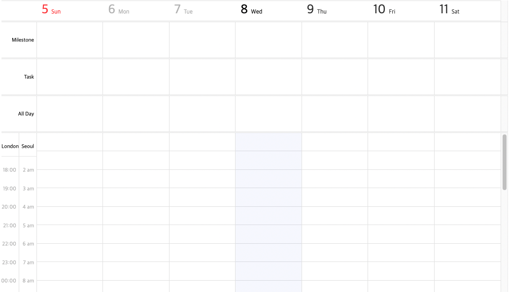
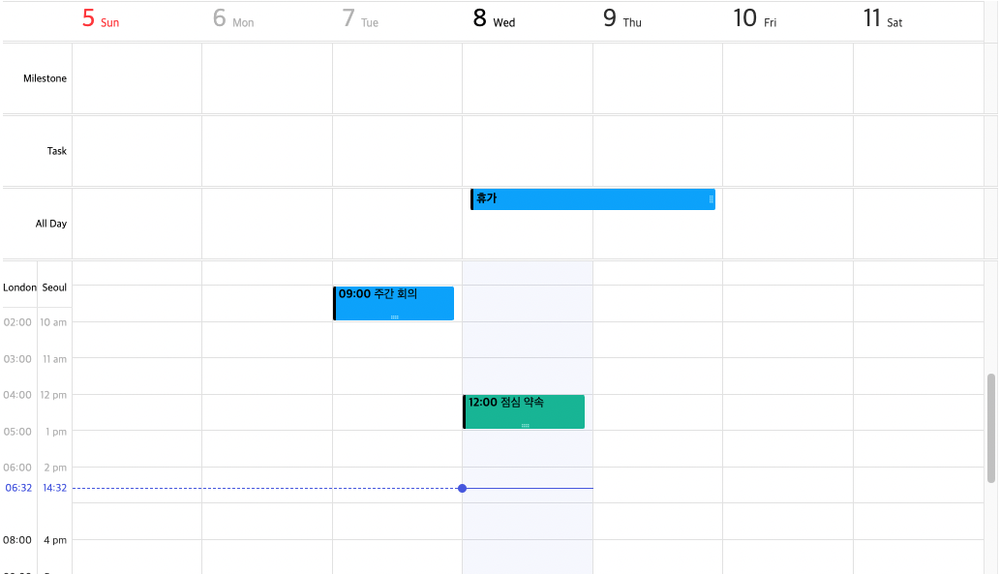
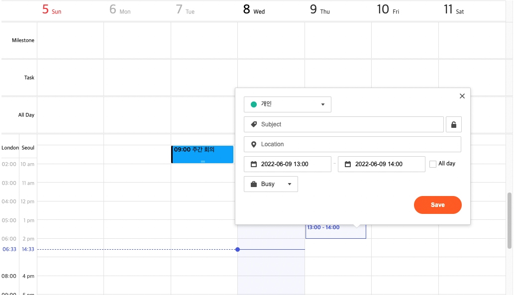
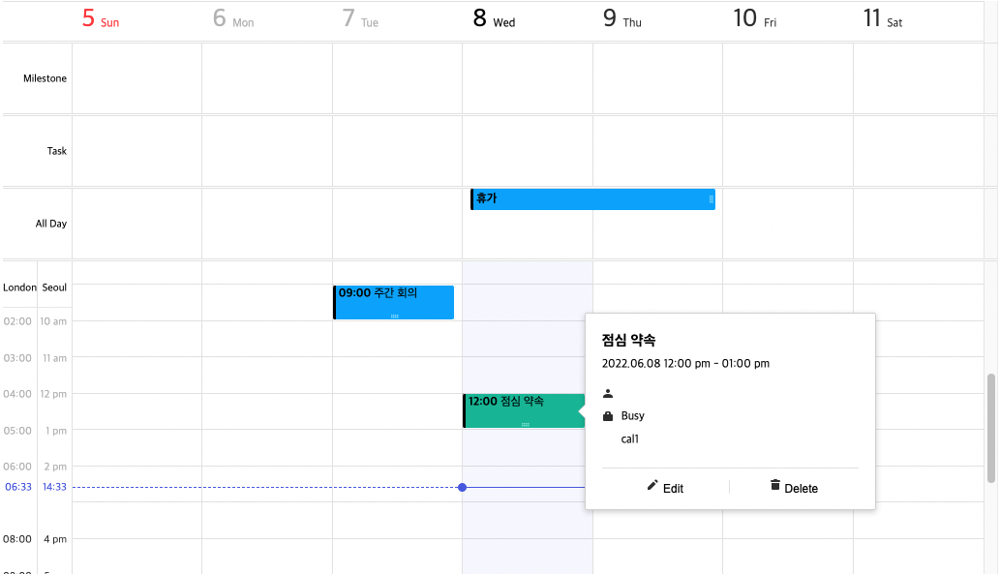
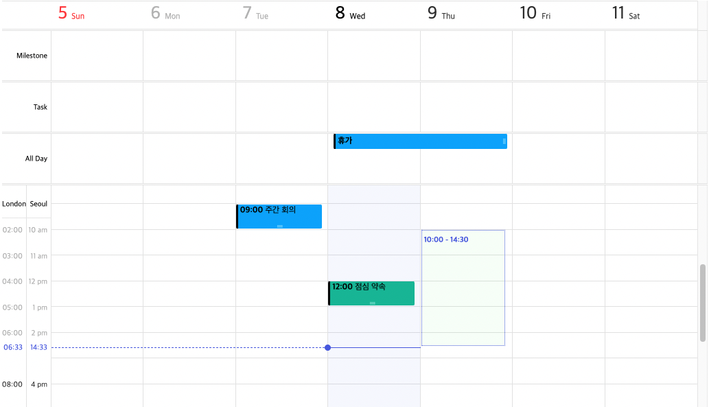
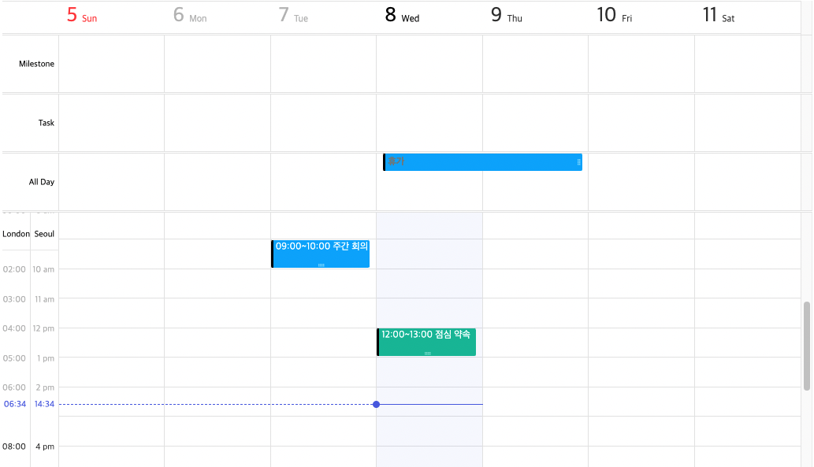
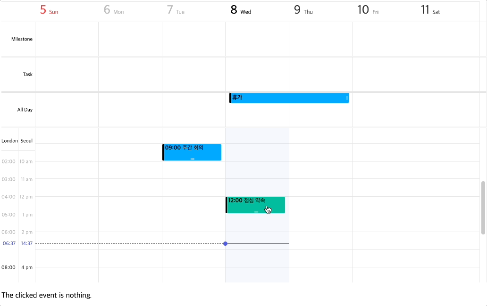

# 시작하기

## 목차

- [설치하기](#설치하기)
  - [패키지 매니저 사용하기](#패키지-매니저-사용하기)
    - [npm](#npm)
  - [Contents Delivery Network (CDN) 사용하기](#contents-delivery-network-cdn-사용하기)
  - [소스 파일 다운로드](#소스-파일-다운로드)
- [사용하기](#사용하기)
  - [HTML](#html)
  - [자바스크립트](#자바스크립트)
    - [불러오기](#불러오기)
    - [레거시 브라우저용 번들 파일 불러오기](#레거시-브라우저용-번들-파일-불러오기)
  - [CSS](#css)
  - [인스턴스 만들기](#인스턴스-만들기)
- [기본적인 사용 방법](#기본적인-사용-방법)
  - [Google Analytics(GA)를 위한 hostname 수집 거부하기](#google-analyticsga를-위한-hostname-수집-거부하기)
  - [일정 생성하기](#일정-생성하기)
  - [팝업 사용하기](#팝업-사용하기)
  - [테마 적용하기](#테마-적용하기)
  - [템플릿 적용하기](#템플릿-적용하기)
  - [인스턴스 이벤트 적용하기](#인스턴스-이벤트-적용하기)

## 설치하기

TOAST UI 제품들은 패키지 매니저를 이용하거나, 직접 소스 코드를 다운받아 사용할 수 있다. 하지만 패키지 매니저 사용을 권장한다.

### 패키지 매니저 사용하기

TOAST UI 제품들은 [npm](https://www.npmjs.com/) 패키지 매니저에 등록되어 있다.
각 패키지 매니저가 제공하는 CLI 도구를 사용하면 쉽게 패키지를 설치할 수 있다. npm 사용을 위해선 [Node.js](https://nodejs.org)를 미리 설치해야 한다.

#### npm

```sh
npm install @toast-ui/calendar # 최신 버전
npm install @toast-ui/calendar@<version> # 2.0 이후 특정 버전
npm install tui-calendar@<version> # 1.x 특정 버전
```

### Contents Delivery Network (CDN) 사용하기

TOAST UI Calendar는 CDN을 통해 사용할 수 있다.

- 아래의 코드로 CDN을 사용할 수 있다.

```html
<link rel="stylesheet" href="https://uicdn.toast.com/calendar/latest/toastui-calendar.min.css" />
<script src="https://uicdn.toast.com/calendar/latest/toastui-calendar.min.js"></script>

<!-- 레거시 브라우저용 번들 파일 가져오기 -->
<!-- <script src="https://uicdn.toast.com/calendar/latest/toastui-calendar.ie11.min.js"></script> -->

<!-- 모듈로 가져오기 -->
<!-- <script type="module" src="https://uicdn.toast.com/calendar/latest/toastui-calendar.mjs"></script> -->
```

- CDN은 아래의 디렉토리 구조로 구성되어 있다.

```
- uicdn.toast.com/
  ├─ calendar/
  │  ├─ latest
  │  │  ├─ toastui-calendar.css
  │  │  ├─ toastui-calendar.js
  │  │  ├─ toastui-calendar.min.css
  │  │  ├─ toastui-calendar.min.js
  │  │  ├─ toastui-calendar.ie11.js
  │  │  ├─ toastui-calendar.ie11.min.js
  │  │  │  toastui-calendar.mjs
  │  ├─ v2.0.0/
```

### 소스 파일 다운로드

- [각 버전의 소스코드 다운로드 하기](https://github.com/nhn/tui.calendar/releases)

## 사용하기

### HTML

TOAST UI Calendar가 생성될 컨테이너 요소를 추가한다. **이 요소는 적절한 높이의 height 값을 가지고 있어야 한다. (최소 600px 이상 권장)**

```html
<div id="calendar" style="height: 600px;"></div>
```

### 자바스크립트

#### 불러오기

TOAST UI Calendar는 생성자 함수를 통해 인스턴스를 생성할 수 있다. 생성자 함수에 접근하기 위해서는 환경에 따라 접근할 수 있는 세 가지 방법이 존재한다.

```js
/* Node.js 환경에서 ES6 모듈 */
import Calendar from '@toast-ui/calendar';
```

```js
/* Node.js 환경에서 CommonJS */
const Calendar = require('@toast-ui/calendar');
```

```js
/* 브라우저 환경에서 namespace */
const Calendar = tui.Calendar;
```

#### 레거시 브라우저용 번들 파일 불러오기

TOAST UI Calendar는 레거시 브라우저용 번들 파일을 따로 제공하고 있다. 기본 번들은 모던 브라우저의 최신 2개 버전을 안정적으로 지원한다. 하지만 기본 번들은 IE11을 위한 폴리필이 포함되어있지 않으므로 IE11 혹은 일정 수준 이하의 레거시 브라우저를 지원하기 위해서는 다음과 같이 폴리필이 포함된 IE11 번들을 추가해야 한다.

IE11의 번들 크기는 기본 번들보다 30%가량 크기 때문에 반드시 지원 범위를 잘 고려하여 불필요하게 번들 사이즈를 늘리지 않도록 유의해야 한다.

```js
/* Node.js 환경에서 ES6 모듈 */
import Calendar from '@toast-ui/calendar/ie11';
```

```js
/* Node.js 환경에서 CommonJS */
const Calendar = require('@toast-ui/calendar/ie11');
```

```html
<!-- CDN과 브라우저 환경에서 namespace -->
<script src="https://uicdn.toast.com/calendar/latest/toastui-calendar.ie11.min.js"></script>
<script>
  const Calendar = tui.Calendar;
</script>
```

### CSS

Calendar를 사용하기 위해서는 CSS 파일을 추가해야 한다. import, require를 통해 CSS 파일을 불러오거나, CDN을 통해 불러올 수 있다.

```js
/* Node.js 환경에서 ES6 모듈 */
import '@toast-ui/calendar/toastui-calendar.min.css'; // Calendar 스타일
```

```js
/* Node.js 환경에서 CommonJS */
require('@toast-ui/calendar/toastui-calendar.min.css');
```

```html
<!-- CDN -->
<link rel="stylesheet" href="https://uicdn.toast.com/calendar/latest/toastui-calendar.min.css" />
```

### 인스턴스 만들기

생성자 함수는 `container`, `options` 두 개를 인자로 갖는다.

- `container`: TOAST UI Calendar를 자식 요소로 갖는 HTML 요소 또는 HTML 요소를 가져오기 위한 CSS 선택자 문자열
- `options`: 기본 뷰 타입, 타임존, 테마, 템플릿 등 TOAST UI Calendar를 커스터마이징할 수 있는 옵션 객체. 자세한 정보는 [옵션 문서](../apis/options.md)를 참고한다.

```js
const container = document.getElementById('calendar');
const options = {
  defaultView: 'week',
  timezone: {
    zones: [
      {
        timezoneName: 'Asia/Seoul',
        displayLabel: 'Seoul',
      },
      {
        timezoneName: 'Europe/London',
        displayLabel: 'London',
      },
    ],
  },
  calendars: [
    {
      id: 'cal1',
      name: '개인',
      backgroundColor: '#03bd9e',
    },
    {
      id: 'cal2',
      name: '직장',
      backgroundColor: '#00a9ff',
    },
  ],
};

const calendar = new Calendar(container, options);
```



## 기본적인 사용 방법

### Google Analytics(GA)를 위한 hostname 수집 거부하기

[TOAST UI 캘린더](https://github.com/nhn/tui.calendar)는 [GA](https://analytics.google.com/analytics/web/)를 적용하여 오픈 소스 사용에 대한 통계를 수집하여 전 세계에서 얼마나 널리 사용되는지 확인한다.
이는 프로젝트의 향후 진행을 결정하는 중요한 지표 역할을 한다.
`location.hostname`(예를 들어 "ui.toast.com")을 수집하며 사용량에 대한 통계를 측정하기 위해서만 사용된다.

만약 이를 거부하려면 [`usageStatistics` 옵션](/docs/ko/apis/options.md#usagestatistics)을 `false`로 설정한다.

```js
const calendar = new Calendar('#calendar', {
  usageStatistics: false
});
```

### 일정 생성하기

일정을 생성할 때는 Calendar 인스턴스의 [`createEvents` 메서드](../apis/calendar.md#createevents)를 사용한다.

일정 정보는 [EventObject](../apis/event-object.md) 형태로 넘긴다.

```js
calendar.createEvents([
  {
    id: 'event1',
    calendarId: 'cal2',
    title: '주간 회의',
    start: '2022-06-07T09:00:00',
    end: '2022-06-07T10:00:00',
  },
  {
    id: 'event2',
    calendarId: 'cal1',
    title: '점심 약속',
    start: '2022-06-08T12:00:00',
    end: '2022-06-08T13:00:00',
  },
  {
    id: 'event3',
    calendarId: 'cal2',
    title: '휴가',
    start: '2022-06-08',
    end: '2022-06-10',
    isAllday: true,
    category: 'allday',
  },
]);
```



### 팝업 사용하기

TOAST UI Calendar는 일정 생성 팝업과 일정 상세 팝업을 기본으로 제공한다. 이를 사용하려면 [`useFormPopup`](../apis/options.md#useformpopup)과 [`useDetailPopup`](../apis/options.md#usedetailpopup) 옵션을 `true`로 설정해야 한다. 옵션은 인스턴스 생성 시 설정하거나, 인스턴스 생성 후 [`setOptions`](../apis/calendar.md#setoptions) 메서드를 사용해서 변경할 수 있다.

일정 생성 팝업을 사용할 때는 [`tui-date-picker`](https://github.com/nhn/tui.date-picker)와 [`tui-time-picker`](https://github.com/nhn/tui.time-picker)의 css 파일을 가져와야 스타일이 제대로 적용된다.

```sh
npm install tui-date-picker tui-time-picker
```

```js
// 일정 생성 팝업을 사용하기 위해 tui-date-picker와 tui-time-picker의 css 파일을 불러온다.
import 'tui-date-picker/dist/tui-date-picker.css';
import 'tui-time-picker/dist/tui-time-picker.css';

calendar.setOptions({
  useFormPopup: true,
  useDetailPopup: true,
});
```

| 일정 생성 팝업                                    | 일정 상세 팝업                                        |
| ------------------------------------------------ | ----------------------------------------------------- |
|  |  |

### 테마 적용하기

색상, 배경색과 같은 스타일을 변경하고 싶을 때는 테마를 사용한다. 테마는 인스턴스 생성 시 [옵션 객체의 `theme` 프로퍼티](../apis/options.md#theme)에 명시하거나, 인스턴스 생성 후 [`setTheme`](../apis/calendar.md#settheme) 메서드를 사용해서 변경할 수 있다. 적용 가능한 테마는 [테마 문서](../apis/theme.md)를 참고한다.

```js
calendar.setTheme({
  common: {
    gridSelection: {
      backgroundColor: 'rgba(81, 230, 92, 0.05)',
      border: '1px dotted #515ce6',
    },
  },
});
```



### 템플릿 적용하기

템플릿은 커스텀 렌더링을 지원하는 기능이다. 인스턴스 생성 시 [옵션 객체의 `template` 프로퍼티](../apis/options.md#template)에 명시하거나, 인스턴스 생성 후 [`setOptions`](../apis/calendar.md#setoptions) 메서드를 사용해서 변경할 수 있다. 적용 가능한 템플릿은 [템플릿 문서](../apis/template.md)를 참고한다.

```js
function formatTime(time) {
  const hours = `${time.getHours()}`.padStart(2, '0');
  const minutes = `${time.getMinutes()}`.padStart(2, '0');

  return `${hours}:${minutes}`;
}

calendar.setOptions({
  template: {
    time(event) {
      const { start, end, title } = event;

      return `<span style="color: white;">${formatTime(start)}~${formatTime(end)} ${title}</span>`;
    },
    allday(event) {
      return `<span style="color: gray;">${event.title}</span>`;
    },
  },
});
```



### 인스턴스 이벤트 적용하기

TOAST UI Calendar는 인스턴스 이벤트를 제공한다. 필요에 따라 이벤트를 수신하도록 설정하여 원하는 동작을 실행시킬 수 있다. 또한 별도로 사용자가 자신만의 이벤트를 설정할 수도 있다.

`on` 메서드를 사용하여 인스턴스 이벤트를 수신할 수 있다.

자세한 내용은 [인스턴스 이벤트 문서](../apis/calendar.md#인스턴스-이벤트)를 참고한다.

```js
calendar.on('clickEvent', ({ event }) => {
  const el = document.getElementById('clicked-event');
  el.innerText = event.title;
});
```


